# RayTracying


RayTracying最关键的点是： 

👁看出去的世界

而非世界如何达到👁


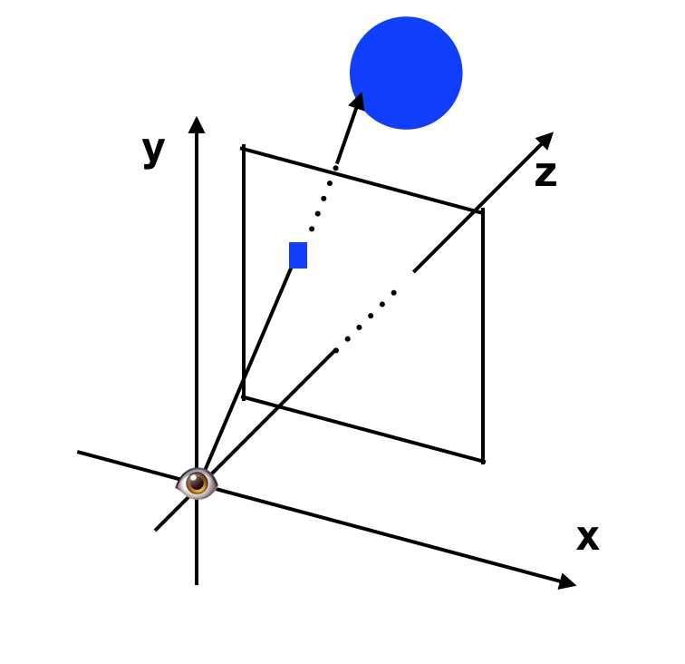


这也是这个算法叫做ray tracying - 光线跟踪的原因。


# 例子

## 1.预备知识

### 1.1 屏幕坐标 vs 画布坐标

一般来说屏幕坐标都是始于左上角，然后朝右和下延伸。


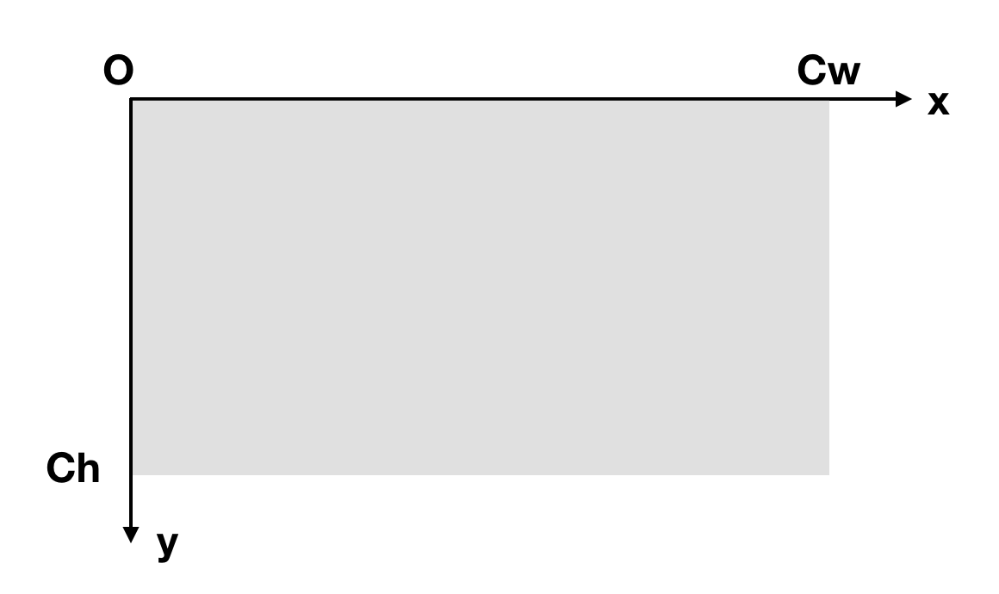

不过这里为了作图方便，我们把坐标系按照数学中更常见的方式把原点放于屏幕中央，x和y的延伸方向按照平时的习惯来放。

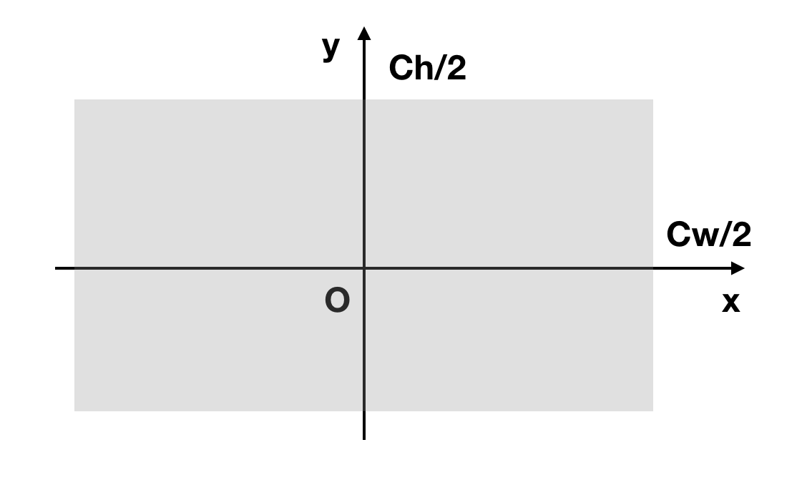
这样可以知道屏幕坐标系$S_x$和画布坐标系$C_x$的变换:


$$
S_x = \frac{C_w}{2} + C_x
$$
$$
S_y = \frac{C_h}{2} - C_y
$$

### 1.2 画布 vs 窗户

因为我们屏幕是二维的，无论我们怎样模拟，实际上都是要把物体画在一个二维的平面（画布）上，我们这里就假设我们把👁放在原点上，而有一扇窗户在坐标轴 z = d 处 ，我们眼睛能看到的也就是窗户出去的世界。

那么对于画布上的任意一点，在窗户上都有一个对应的位置，因为它们是中心相同平面平行。

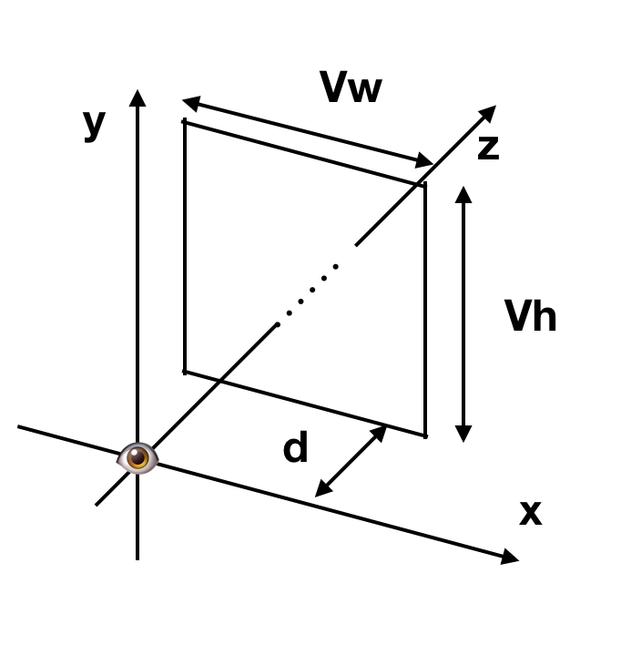

所以对画布上的每一个点$C_x, C_y$我们都能找到窗户上的对应点$V_x, V_y$，加上上一段话中的对应关系，实际上就是一个比例的问题，所以我们可以继续知道画布坐标系$C_x, C_y$在窗户上的对应坐标$V_x, V_y$为：

$$
V_x = C_x\frac{V_w}{C_w}
$$
$$
V_y = C_y\frac{V_h}{C_h}
$$

同时因为窗户放在 z = d 处，我们知道：

$$
V_z = d
$$

这就有了如何将画布上的每一点转化为窗户上的每一点的坐标变换。

### 1.3 窗户 vs 空间

从眼睛👁射出的光线，我们都可以看成是$\overrightarrow{OP}$。

同时P点位置也可以写成： $P = O + t(V-O)$, 令$\overrightarrow{D}$为$V-O$，也就是其方向的向量，如下图：

$$
P = O + t\overrightarrow{D}
$$

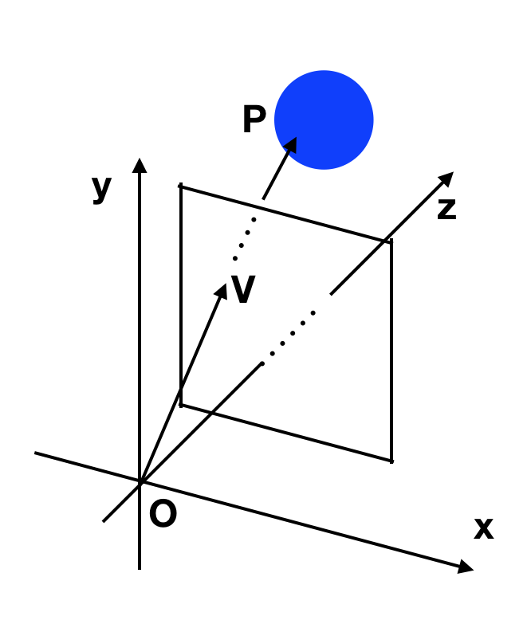

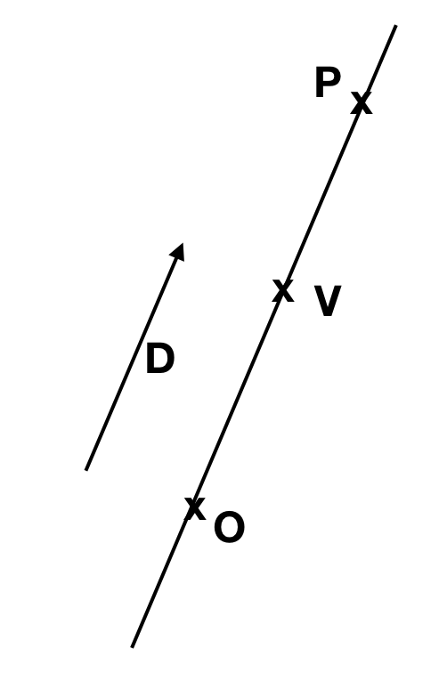

这里需要注意的是: O,P,V是位置，$\overrightarrow{OP}， \overrightarrow{D}$是向量。


同时知道：

- t < 0: 逆向于光线上的点
- t = 0: 原点
- t > 0 && t < 1: 原点到V点之间的点，也就是原点到窗户之间的点
- t = 1: V点
- t > 1: V点之后，依旧在射出的光线之上，当t取某个值为P点


## 2.空间放物体

这里我们在空间中放置一个球体


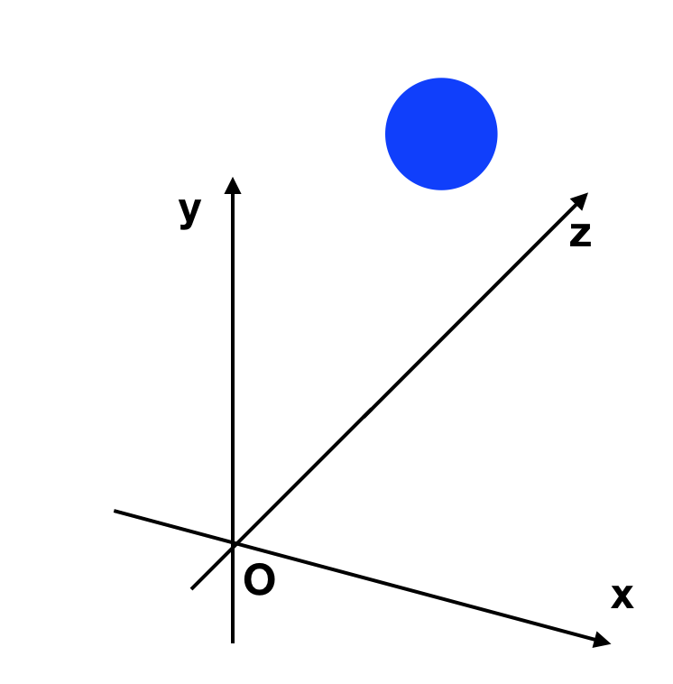


球心为C，那么球上点P需要满足方程：

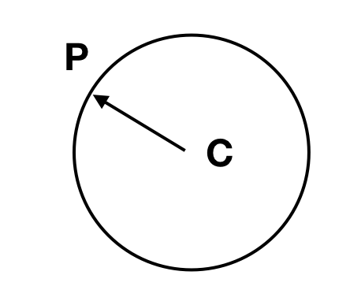


$$
|P - C| = r 
$$

## 3. 处理交互 跟踪光线


假设OP就是我们看出去的光线，来追踪它，当看向球体时，它会与球体产生交互，图中这条光线就是和球体相遇了：

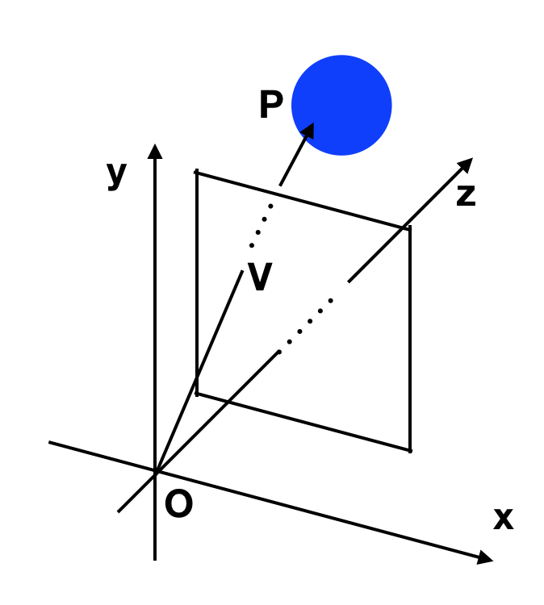

球上的属于这条光线的P点应该满足：

$$
P = O + t\overrightarrow{D}
$$

$$
|P - C| = r 
$$

代入1式进2式：

$$
| O + t\overrightarrow{D} - C| = r 
$$
$$
| t\overrightarrow{D} + \overrightarrow{OC}| = r 
$$


来解方程：

$$
(t\overrightarrow{OD} + \overrightarrow{OC})(t\overrightarrow{OD} +\overrightarrow{OC}) = r^2 
$$


展开：

$$
t^2|\overrightarrow{OD}|^2 + 2 t\overrightarrow{OD}\cdot\overrightarrow{OC} + |\overrightarrow{OC}|^2 -r^2 = 0 
$$


令 

$$
k_1 = |\overrightarrow{OD}|^2 ​
$$

$$
k_2 = 2 \overrightarrow{OD}\cdot\overrightarrow{OC}​
$$

$$
k_3 = |\overrightarrow{OC}|^2 -r^2
$$

这就变成解关于t的一元二次方程：

$$
{t_1, t_2} 
= \begin{equation}
\frac{ -k_2 \pm \sqrt{k_2^2 - 4k_1k_3} }
{2k_1}
\end{equation}
$$

会出现：

- $k_2^2 - 4k_1k_3 > 0$ ： 两个解
- $k_2^2 - 4k_1k_3 = 0$ ： 一个解
- $k_2^2 - 4k_1k_3 < 0$ ： 无解

对应的就是下图的状况：

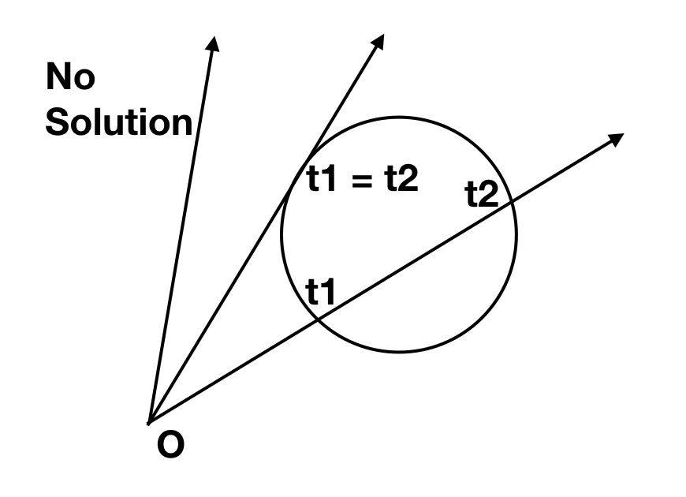


所以问题就变简单了，如果我们有交互，那么我们应该展示的是近的点$t_1$的颜色，如果我们没有交互，那么我们展示的就是背景色。


以上就是光线追踪的根本原理。

## 至此の伪码


### 跟踪光线与球相交 IntersectRaySphere


```
IntersectRaySphere(O, D, sphere){
	C = sphere.center
	r = sphere.radius
	oc = O - C
	
	k1 = dot(OD, OD)
	k2 = 2 * dot(OC, OD)
	k3 = dot(OC,OC) - r*r
	
	discriminant = k2 * k2 - 4 * k1 * k3
	if discriminant < 0:
		return inf, inf
	
	t1 = (-k2 + sqrt(discriminant))/(2*k1)
	t2 = (-k2 - sqrt(discriminant))/(2*k1)
	return t1, t2
}
```


### t1 的颜色TraceRay

这里我们在空间里放入好几个球体，然后计算t1处的颜色伪码如下：

```
TraceRay(O, D, t_min, t_max){
	closest_t = inf
	closest_sphere = NULL
	for sphere in scene.Spheres {
		t1, t2 = IntersectRaySphere(O, D, sphere)
		if t1 in [t_min, t_max] && t1 < closest_t
			closest_t = t1
			closest_sphere = sphere
		if t2 in [t_min, t_max] && t2 < closest_t
			closest_t = t2
			closest_sphere = sphere
	}

	if closest_sphere == NULL
		return BACKGROUND_COLOR
	
	return closest_sphere.color 
}
```

我们在空间中放入三个小球：

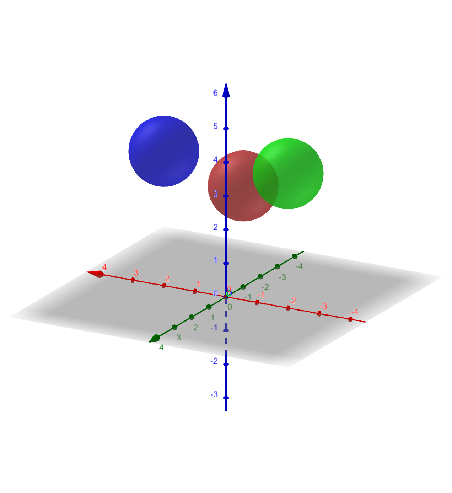

### 画到画布上

在上述三个伪码函数中，最终是TraceRay这个函数调用了其余两个函数，那么我们现在需要来设定它的参数。

#### D

D这个实际上之前已经写到，就是从O到V的向量，那么我们的V又由最早的画布到窗户可以得知，所以我们可以有函数：

```
CanvasToViewport(x, y){
	return (x * Vw/Cw, y * Vh/Ch, d)
}
```


### t\_min, t_max

t = 1 是V，是在窗户上，t > 1 是窗户之后，是场景，所以我们需要取的值是 t\_min = 1,我们并不需要摄像头和窗户之间的颜色，因为我们也没有放任何东西在那里，我们需要的是窗户之后的景色，所以 t\_min = 1, t_max = inf


#### 组装

最后，我们需要的是来做循环，把所有的代码组装在一起，放在屏幕上，所以伪码如下：

```
O = <0,0,0>

for x in [-Cw/2, Cw/2]{
	for y in [-Ch/2, Ch/2]{
		D = CanvasToViewport(x, y)
		color = TraceRay(O, D, t_min, t_max)
		canvas.putPixel(x, y, color)
	}
}
```


对应的窗户大小和距离都可以在代码中看到，看结果：

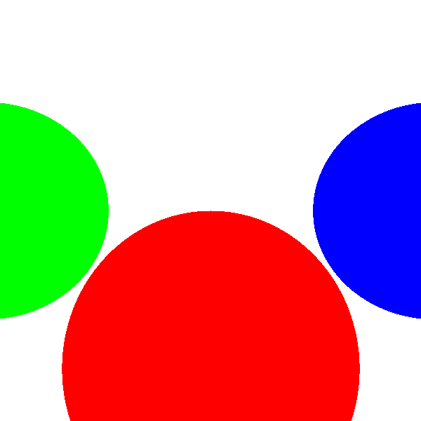


这根本看起来不3d，很简单，因为我们并没有考虑**光**的作用。


[代码链接](code/raytracying01.py)

