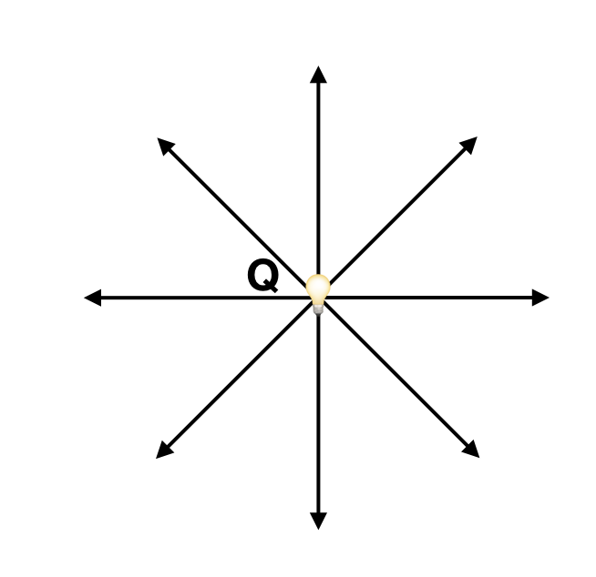
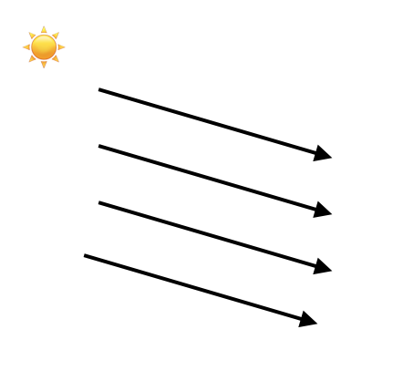
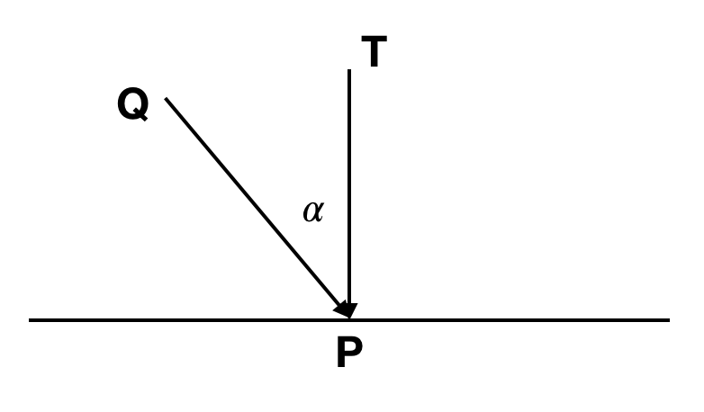
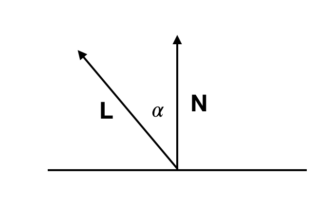
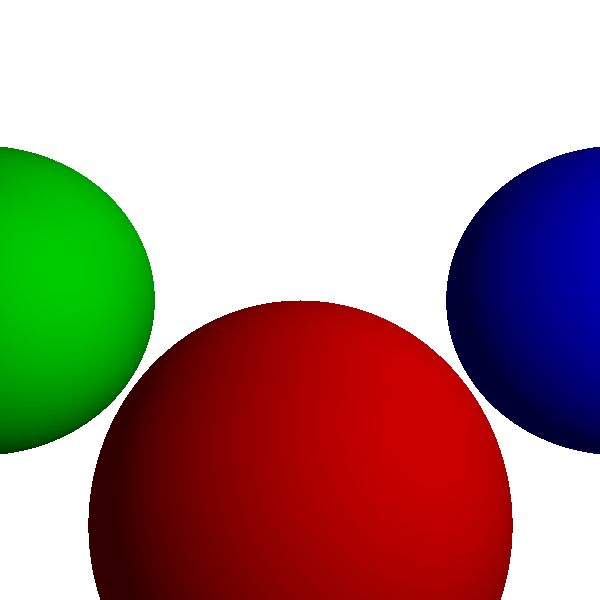

# 颜色模拟

上面写到我们需要展示$t_1​$的颜色，那么$t_1​$都颜色究竟应该是怎样的？应该就是它自身的颜色和光相互作用的结果，我们这里命事物本身颜色为c, P点处光的强度为i（这里我们只考虑白光）， 那么比如 c * i 就会是最终的颜色，一般来说 0 < i < 1，比如 i 是 0.5，那么物体就会变成原来的一半亮。

以下的模拟，有些会用到自然界中可能事物的真实样子，有些就是纯粹的数学模型。

## 1.光源


### 1.1 环境光

环境光很简单，我们直接给一个数字$I_A$.这样就代表了周围环境的光

### 1.2 点光源

点光源就像电灯泡一样，固定于一个点，然后发出光线于四周，对于点光源，我们只需它的位置Q和强度$I_Q​$.



### 1.3 方向光

方向光就类似于自然界中的太阳光，我们需要知道它的方向$\overrightarrow{L}$和强度$I_A$.



## 2 光与物体

### 2.1 漫反射

漫反射是这样，达到物体表面的表面的光实际上只有$\overrightarrow{QP}$ 在$\overrightarrow{TP}$ 方向的投影,实际上P点得到的强度是$I \cdot cos\alpha$.

注意我们只考虑$cos\alpha$ 大于0的状况，因为如果小于零，它是到达了物体的背面。





$$cos\alpha =  \frac{\overrightarrow{QP} \cdot \overrightarrow{TP}}{|\overrightarrow{QP}| \cdot |\overrightarrow{TP}|} $$

为了计算方便，令**$\overrightarrow{L}$表示我们指向光源的方向**，$\overrightarrow{N}$为物体表面的法向量：




$$cos\alpha =  \frac{\overrightarrow{L} \cdot \overrightarrow{N}}{|\overrightarrow{L}| \cdot |\overrightarrow{N}|} ​$$

可以得到光叠加的效果是：

$$
I = I_A + \displaystyle\sum_{i=1}^{n} I_i \frac{\overrightarrow{L_i} \cdot \overrightarrow{N}}{|\overrightarrow{L_i}| \cdot |\overrightarrow{N}|}
$$

至此，我们就可以画出空间中很好看的效果了。

## 至此の伪码

### 跟踪光线与球相交 IntersectRaySphere

入之前写的

### t1 处的光ComputeLighting

在以下的伪码中，P是物体表面的位置，N是物体表面的法向量。


```
ComputeLighting(P, N) {
    i = 0.0
    for light in scene.Lights {
        if light.type == ambient {
            i += light.intensity
        } else {
            if light.type == point
                L = light.position - P
            else
                L = light.direction

            n_dot_l = dot(N, L)
            if n_dot_l > 0
                i += light.intensity*n_dot_l/(length(N)*length(L))
        }
    }
    return i
}
```

### t1 的颜色TraceRay

这里我们在空间里放入好几个球体，然后计算t1处的颜色伪码如下：

```
TraceRay(O, D, t_min, t_max){
	closest_t = inf
	closest_sphere = NULL
	for sphere in scene.Spheres {
		t1, t2 = IntersectRaySphere(O, D, sphere)
		if t1 in [t_min, t_max] && t1 < closest_t
			closest_t = t1
			closest_sphere = sphere
		if t2 in [t_min, t_max] && t2 < closest_t
			closest_t = t2
			closest_sphere = sphere
	}

	if closest_sphere == NULL
		return BACKGROUND_COLOR
	
	P = O + closest_t * D #交点P的位置
	N = P - closest_sphere.center #计算P处的法向量
	N = N / length(N) #normalize 法向量
	return closest_sphere.color * ComputeLighting(P, N)
}
```

### 画到画布上


看结果：




效果已经比之前好很多了。

[代码链接](code/raytracying02.py)


