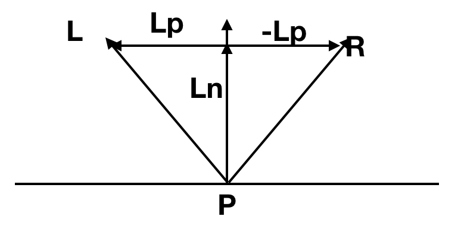

## 镜面反射

镜面反射我们依靠的就是纯粹的一个数学模拟。


L指向光源，N依旧为法向量，R为镜面反射形成的光，它有着这样的特别之处，那就是我们从观察方向V来看，随着$\alpha$角度的增大，这个光会锐减的很快。


看函数$cos\alpha$,当 $\alpha$为0的时候，这个值刚好为1，当$\alpha$增加到90°时候，这个值刚好减少到0.

所以我们可以用函数$cos^s \alpha$来模拟物体的镜面指数。


那么镜面反射将会造成的$\overrightarrow{R}$在观看角度$\overrightarrow{V}$的值的计算如下：




$$\overrightarrow{L_N} =\overrightarrow{N} （\overrightarrow{L} \cdot \overrightarrow{N}）$$
$$\overrightarrow{L_p} = \overrightarrow{L} - \overrightarrow{L_N}$$
$$\overrightarrow{R} = \overrightarrow{L_N} + (\overrightarrow{-L_P})$$

代入可得
$$\overrightarrow{R} = 2 \cdot \overrightarrow{N} （\overrightarrow{L} \cdot \overrightarrow{N}）- \overrightarrow{L}$$


所以从$\overrightarrow{V}$方向得到的镜面反射光强度是：

$$I_s = I_L(\frac{\overrightarrow{N} \cdot \overrightarrow{V}}{|\overrightarrow{N}| |\overrightarrow{V}|})^s$$

依旧记住我们只需要考虑大于0的状况.


## 至此の伪码

之前的伪码依旧适用，我们需要考虑的是：

1. 增加镜面指数s
2. 调整计算光的部分
 
我们首先给每个小球添加s，s越大会越闪亮(s = -1 表示物体并没有)，按照作者的逻辑，同时我们添加一个巨大的小球，这样她就会像一个平面一样。


在计算镜面反射光的时候我们依旧使用上方的公式，我们已经有 $\overrightarrow{N},\overrightarrow{L}， I_L$, s是小球本身的性质，我们也已经添加，需要的还有$\overrightarrow{V}$,这是我们观察的方向，view direction，记住我们光线追踪的初衷，是从眼睛看出来，所以view direction特别简单，就是$-\overrightarrow{D}$.

所以调整计算光的部分如下

### ComputeLighting

 
```
ComputeLighting(P, N, V, s) {
    i = 0.0
    for light in scene.Lights {
        if light.type == ambient {
            i += light.intensity
        } else {
            if light.type == point
                L = light.position - P
            else
                L = light.direction
            
            # diffuse
            n_dot_l = dot(N, L)
            if n_dot_l > 0
                i += light.intensity*n_dot_l/(length(N)*length(L))
            
            # specular
            if s!= -1 {
            	  R = 2*N*dot(N,L) -L 
            	  r_dot_v = dot(R, V)
            	  if r_dot_v > 0
            	  	   i += light.intensity*pow(r_dot_v/length(R)*length(V)),s)
            }  
        }
    }
    return i
}
```

### TraceRay


```
TraceRay(O, D, t_min, t_max){
	closest_t = inf
	closest_sphere = NULL
	for sphere in scene.Spheres {
		t1, t2 = IntersectRaySphere(O, D, sphere)
		if t1 in [t_min, t_max] && t1 < closest_t
			closest_t = t1
			closest_sphere = sphere
		if t2 in [t_min, t_max] && t2 < closest_t
			closest_t = t2
			closest_sphere = sphere
	}

	if closest_sphere == NULL
		return BACKGROUND_COLOR
	
	P = O + closest_t * D #交点P的位置
	N = P - closest_sphere.center #计算P处的法向量
	N = N / length(N) #normalize 法向量
	return closest_sphere.color * ComputeLighting(P, N, -D, sphere.specular)
}
```


### 相互作用


对于点光源和方向光，实际上到达物体表面的也就是$\overrightarrow{L}$ 在$\overrightarrow{N}$ 方向的投影，也就是$I \cdot cos\alpha$


### 画到画布上


看结果：


[代码链接](code/raytracying03.py)
