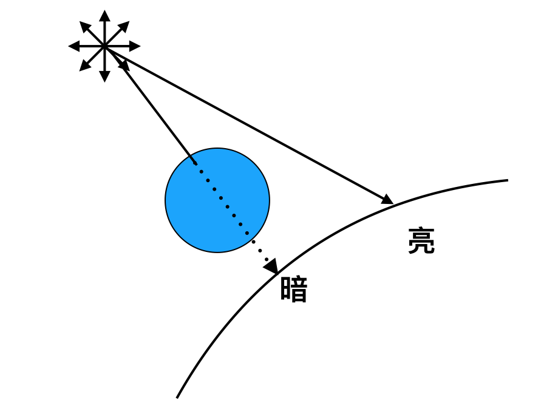
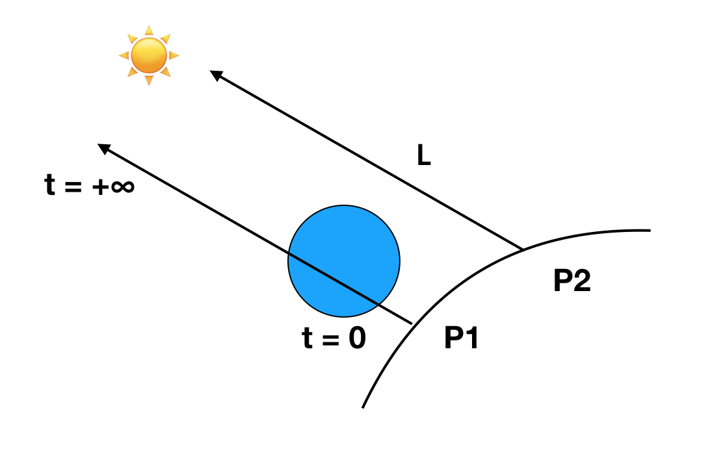
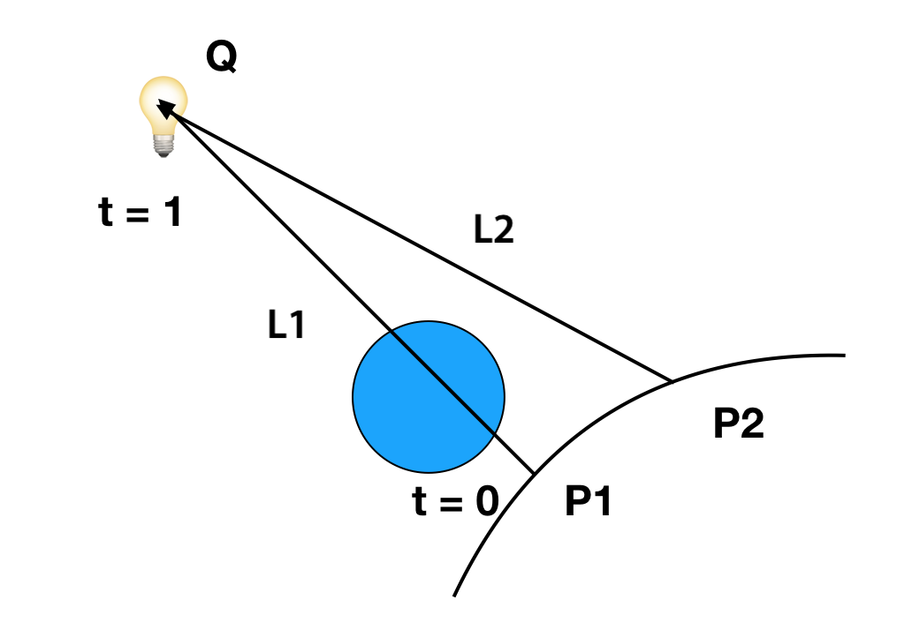
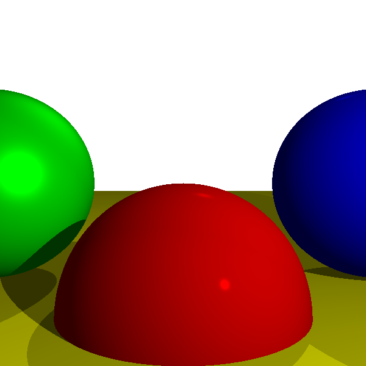

## 阴影

我们追踪一条光线，考虑它碰到的物体，考虑光碰到物体表面发生的漫反射和镜面反射。

在考虑了这些问题以上，我们还有并没有考虑到的问题--影。


影子说起来也很容易考虑，就是如果在某点与光之间有物体阻碍的话，那么这点将是没有光的，否则这点是被点亮的。



### 方向光

我们依旧用L来指向光源，考虑我们想研究的P点状况：



对于P点来说，由它出发指向方向光的路上如果碰到阻碍，那么就说明P点应该为暗，否则P点为亮。

这里实际上我们依旧有工具来计算一条射线与球的最近相交点了，所以工具可以继续使用，这里的 $t_{min} = 0, t_{max} = +∞$
 
 
### 点光源
 
对于点光源来说



指向光源的L我们很容易我们也容易求得，是$Q - P$， 不过这里对应的 $t_{min} = 0, t_{max} = 1$，因为别忘了我们的L是用来指向光源的， $t_{min} = 0$ 就是物体本身所处位置， $t_{max} = 1$就是点光源所在位置。

这里我们还需要注意一点，那就是我们需要当 t = 0 时，实际上物体会在它本身上留下阴影，所以我们取一个极小的t值，比如 t = 0.001 来处理这种状况。


### 环境光

至于环境管，它是均匀分布的，就不用考虑它了。


### 至此の伪码


### ClosestIntersection

这是提取出来，我们用来算从某点射出射线D在给定 t_min, t_max 的情况下跟球的相交和最近的交点。

```
ClosestIntersection(O, D, t_min, t_max){
	closest_t = inf
	closest_sphere = NULL
	for sphere in scene.Spheres {
		t1, t2 = IntersectRaySphere(O, D, sphere)
		if t1 in [t_min, t_max] && t1 < closest_t
			closest_t = t1
			closest_sphere = sphere
		if t2 in [t_min, t_max] && t2 < closest_t
			closest_t = t2
			closest_sphere = sphere
	}

	return closest_sphere, closest_t 
}
```

### TraceRay

TraceRay依旧不变，依旧是算的这条光线应该看到的颜色。

```
TraceRay(O, D, t_min, t_max){
	closest_sphere , closest_t = ClosestIntersection(O, D, t_min, t_max)
	
	if closest_sphere == NULL
		return BACKGROUND_COLOR
	
	P = O + closest_t * D #交点P的位置
	N = P - closest_sphere.center #计算P处的法向量
	N = N / length(N) #normalize 法向量
	return closest_sphere.color * ComputeLighting(P, N, -D, sphere.specular)
}
```

### ComputeLighting

在这里我们增加了检查阴影的部分，如果我们中间碰到了阻碍，那么我们就不用计算光了，它就是暗色 i = 0,否则我们才计算响应的颜色，这里还采用了 0.001 来避免物体在其自身的表面形成阴影。
 
```
ComputeLighting(P, N, V, s) {
    i = 0.0
    for light in scene.Lights {
        if light.type == ambient {
            i += light.intensity
        } else {
            if light.type == point {
                L = light.position - P
                t_max = 1
            }
            else {
                L = light.direction
                t_max = inf   
            }
            
            # shadow check
            shadow_sphere, shadow_t = ClosestIntersection(P, L, 0.001, t_max)
            if shadow_sphere != NULL
            		continue
            
            # diffuse
            n_dot_l = dot(N, L)
            if n_dot_l > 0
                i += light.intensity*n_dot_l/(length(N)*length(L))
            
            # specular
            if s!= -1 {
            	  R = 2*N*dot(N,L) -L 
            	  r_dot_v = dot(R, V)
            	  if r_dot_v > 0
            	  	   i += light.intensity*pow(r_dot_v/length(R)*length(V)),s)
            }  
        }
    }
    return i
}
```

### 画到画布上


看结果：




[代码链接](code/raytracying04.py)
