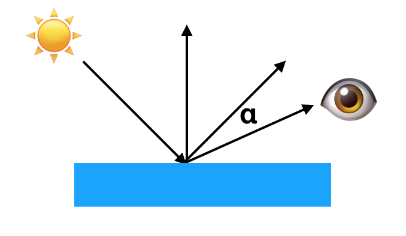
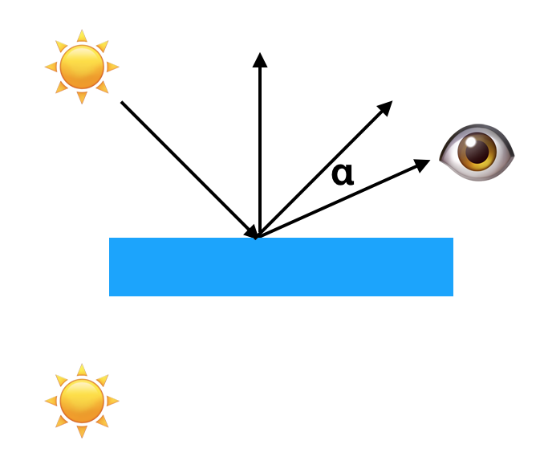
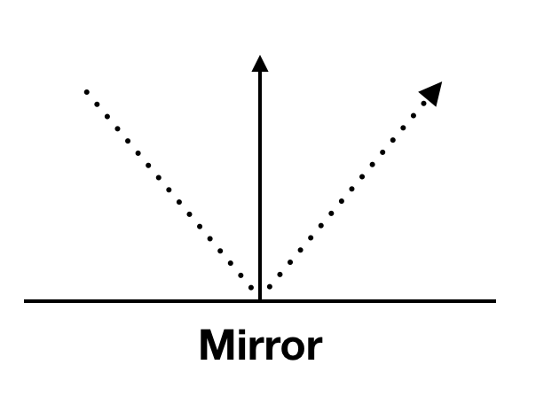
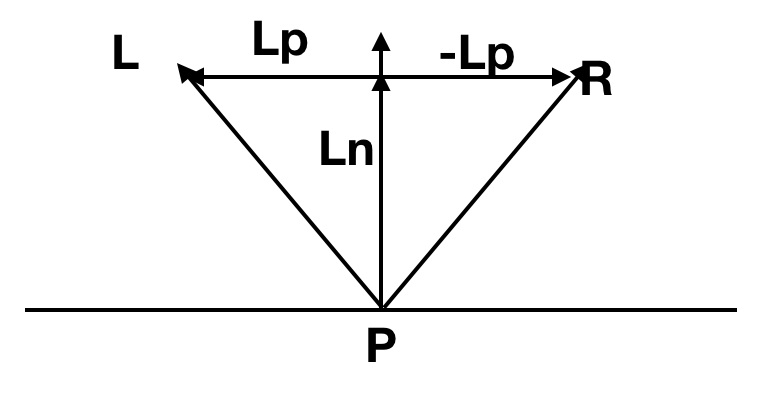
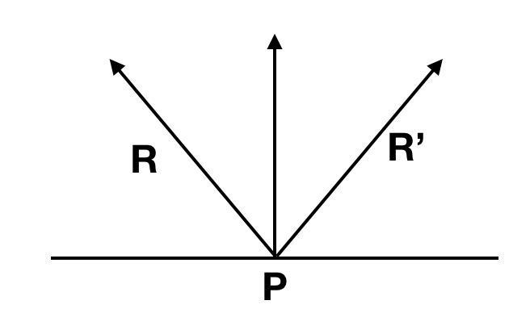
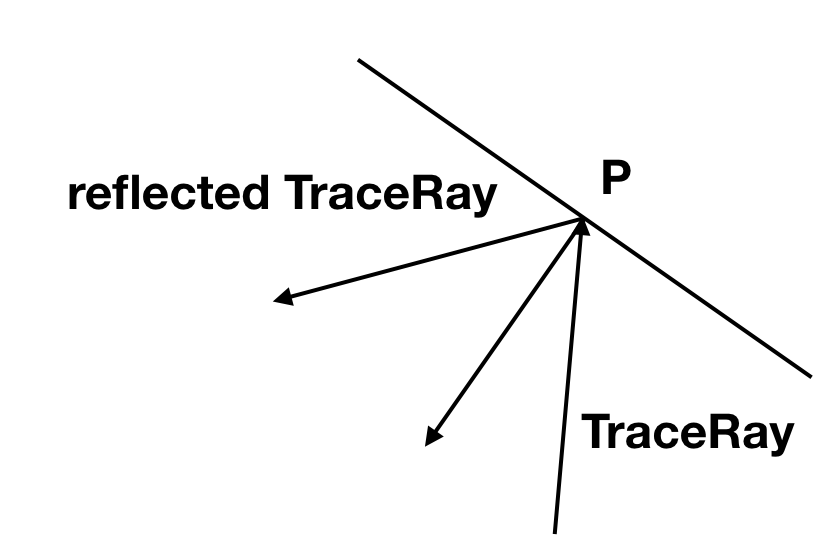
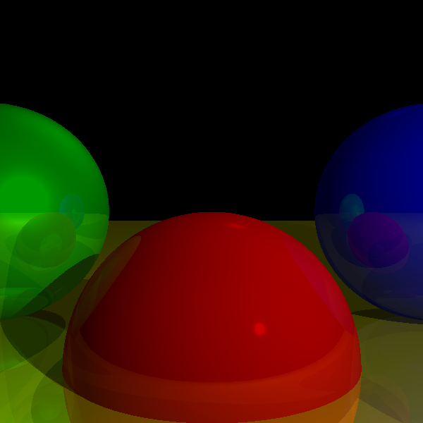
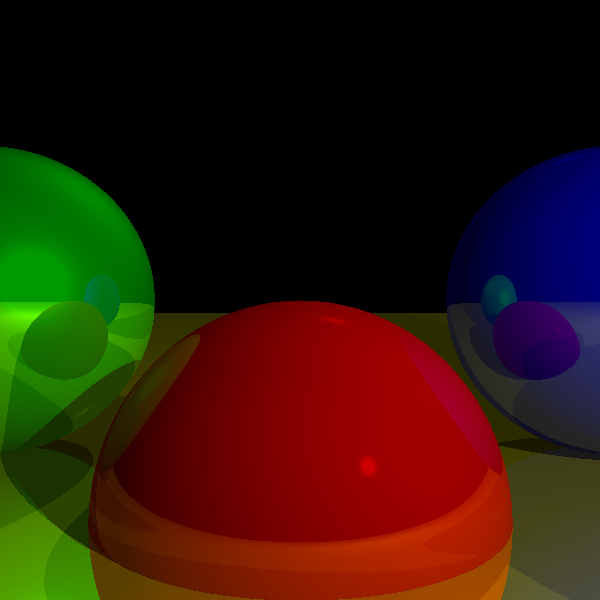

## 镜面反射

物体当然也可以像镜子一样，我们能透过看它看到周围的物体。


### 高光 VS 镜子效果

高光是这样：



我们在眼睛这里看到的依旧是蓝色，这个$\alpha$越大，看到的越暗，$\alpha = 0$则蓝色最强。


镜面反射则是这样：



看下面太阳☀️，这才是镜子的反射效果，我们眼睛看到的则不是蓝色的光，而是物体作为镜子，反射的太阳。


所以添加上镜子的效果之后，此时眼睛看到的颜色是我们之前讨论的 漫反射，高光 以及 镜子效果反射的原始物体的颜色。

### TraceRay

先来看镜子反射的效果




还记得之前的图和式子：



$$
\overrightarrow{R} = 2 \cdot \overrightarrow{N} （\overrightarrow{L} \cdot \overrightarrow{N}）- \overrightarrow{L}
$$

所以如果我们依旧用 $\overrightarrow{R}$ 指向光线来的方向，那么指向反射方向的$\overrightarrow{R'}$ 为：




$$
\overrightarrow{R'} = 2 \cdot \overrightarrow{R} （\overrightarrow{R} \cdot \overrightarrow{N}）- \overrightarrow{R}
$$


对于我们光线追踪来说，特殊之处就在于我们的 TraceRay(O, D, t\_min, t\_max) 函数是用来计算从 O 出发的射线 D， 在给定 t\_min 和 t_max 时会看到的颜色，所以实际上如果我们跟踪的光线如果到达某个镜子反射的表面。那么计算的也就是反射它应当有的颜色：




而这样计算又刚好是 TraceRay 函数在做的事， 从某点出发，给定光线（射线）的方向，给定t\_min, t\_max. 来计算它应当有的颜色，这样我们不用写任何新的函数，再次调用TraceRay函数，目的达到。

但是这里有一个递归的问题，就像两个正对着放的镜子一样，它们都会无止尽的互相反射对方。所以我们需要设定一个递归的系数。

- r = 0: 没有镜子效果
- r = 1: 物体和物体的反射
- r = 2: 物体和物体的反射和物体反射的反射

一般来说，我们并不会让 r > 3.


## 至此の伪码

我们需要添加：

- 物体的反射系数
- 计算R的反射光线
- 把这个加入原本的TraceRay中


### ReflectRay


```
ReflectRay(R, N) {
	return 2*N*dot(N, R) - R
}
```

### TraceRay


```
TraceRay(O, D, t_min, t_max, depth){
	closest_sphere , closest_t = ClosestIntersection(O, D, t_min, t_max)

	if closest_sphere == NULL
		return BACKGROUND_COLOR

	# local color
	P = O + closest_t * D #交点P的位置
	N = P - closest_sphere.center #计算P处的法向量
	N = N / length(N) #normalize 法向量
	local_color = closest_sphere.color * ComputeLighting(P, N, -D, sphere.specular)

	# If we hit the recursion limit or the object is not reflective, we're done
	r = closest_sphere.reflective
	if depth <= 0 or r <= 0:
		return local_color

	# reflected color
	R = ReflectRay(-D, N)
	reflected_color = TraceRay(P, R, 0.001, inf, depth - 1)

	return local_color * (1 - r) + reflected_color*r
}
```


这里面主要更新的部分在这几句：

```
	# If we hit the recursion limit or the object is not reflective, we're done
	r = closest_sphere.reflective
	if depth <= 0 or r <= 0:
		return local_color

	# reflected color
	R = ReflectRay(-D, N)
	reflected_color = TraceRay(P, R, 0.001, inf, depth - 1)

	return local_color * (1 - r) + reflected_color*r
```

而我的重点是在：

1. ReflectRay中的第一个参数是取得指向射入射线的防线，所以我们取-D
2. 我们是从P点开始，然后朝着R方向看出去，同样这里我们不希望物体镜面效果他们本身，所以我们给t_min一个极小值
3. 当然也如同之前提到，给这个递归函数了递归深度以防止它无限循环
4. 最后采用颜色叠加来得到最终的颜色

当然也需要把 主循环中的 color 更新

```
color = TraceRay(O, D, 1, inf, recusion_depth)
```


### 画到画布上


看结果：




这是r = 3, 可以看到物体反射反射再反射的状况。也可以把 r 调整为1来看不同的情况。




可以明显看到作为镜子，反射情况的不同。


[代码链接](code/raytracying05.py)
