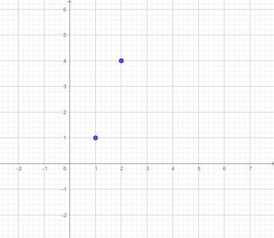
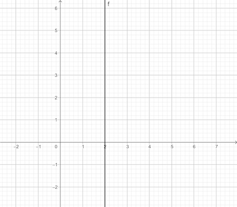

# 画线

我们先从屏幕画线开始。

首先，`y = ax + b` 这个并不能画出所有的线，并且有两个问题：

- 如果a很大，那么x由 $x_0$ 增加到 $x_0+1$ 那么y增加a，如果 a 很大，那么会有分裂的样式




- 无法画出平行于 y 的竖线




针对这种状况，我们采用的画图方式是利用如下的代码：


```
Interpolate (i0, d0, i1, d1){
	if i0 == i1 {
		return [d0]	
	}
	values = []
	a = (d1 - d0) / (i1 - i0)
	d = d0
	for i = i0 to i1{
		values.append(d)
		d = d + a
	} 
	return values
}
```

首先是我们利用的是要么 `y = ax + b` , 要么 `x = ay + b`, 意思是要么我们让 y 随着 x 变化，要么让 x 随着 y 变化. 在上述的伪码中，我们的 d 是 dependent value， i 是 independent value，我们让 d 随着 i 变化。

其次是我们分情况，看线是更加水平或者是更加竖直，如果线更加水平，那么 y 随着x变化，如果更竖直，那么x 随着y变化，这样来作图。


```
DrawLine(P0, P1, color) {
	if abs(x1 - x0) > abs(y1 -y0){
		# Line is horizontal-ish
		# Make sure x0 < x1
		if x0 > x1 {
			swap(P0, P1)
		}
		ys = Interpolate(x0, y0, x1, y1)
		for x = x0 to x1{
			canvas.PutPixel(x, ys[x-x0], color)
		}
	} else {
		# Line is vertical-ish
		# Make sure y0 < y1
		if y0 > y1 {
			swap(P0,P1)
		}
		xs = Interpolate(y0, x0, y1, x1)
		for y = y0 to y1{
			canvas.PutPixel(xs[y-y0], y, color)
		}
	}
}
```

## 画出来


[代码](code/raster01.py)
