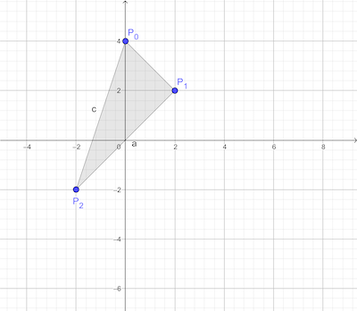
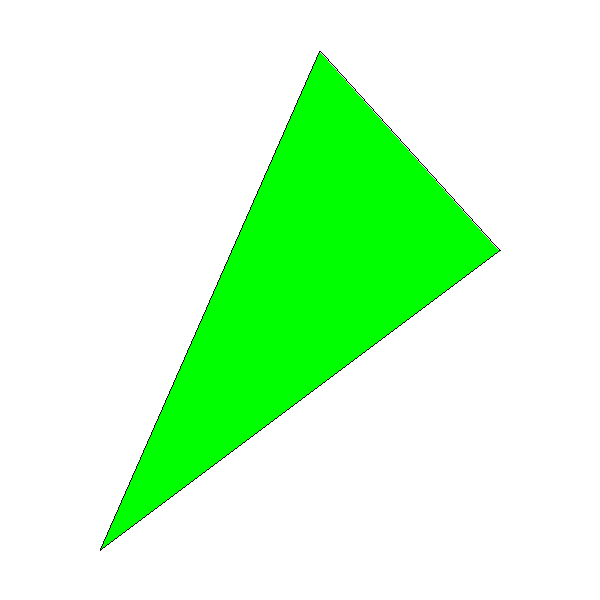

# 画三角形

如果我们只是画一个三角形的框架很简单：

```
DrawWireframeTriangle( P0, P1, P2, color){
	DrawLine(P0, P1, color);
	DrawLine(P1, P2, color);
	DrawLine(P2, P0, color);
}
```

像这样：



不过如果我们想给这个三角形填色好像就需要一点思考，一个最简单的想法就是对于每个y值我们找出这个三角形对应的x值 x\_left 和 x\_right，然后画一条 x\_left 到 x\_right 的线。


```
for each horizontal line y occupied by the triangle
	compute x_left and x_right for this y
	DrawLine(x_left, y, x_right, y)
```

首先我们来保证三个点的纵坐标是$P_0, P_1, P_2$方向增大的，有$y_0 \leq y_1 \leq y_2$. 所以这样我们可以知道 y 的范围是 $[y_0, y_2]$，可以通过以下代码达到：


```
if y1 < y0 { swap(p1, p0) }
if y2 < y0 { swap(p2, p0) }
if y2 < y1 { swap(p2, p1) }
```

然后我们再来计算 x\_left 和 x\_right，因为$P_0P_2$ 是一条长边，那么两条短的边就是$P_0 P1$ 和$P_1 P2$，我们可以计算得到这三条边的x随着y的变化：

```
x01 = Interpolate(y0, x0, y1, x1)
x12 = Interpolate(y1, x1, y2, x2)
x02 = Interpolate(y0, x0, y2, x2)
```

注意这里算的是一个数组[ ],是 x 随着y值的变化的数组。

x02 一定是 x_left 或者 x_right， 另外一边将是 x01 和 x12 的组合。

同时我们注意有一个重复的值，就是在 $P_1$ 处，所以：

```
remove_last(x01)
x012 = x01 + x12
```

现在我们已经有了 x02 和 x012， 决定x\_left 和 x\_right的时刻到了，我们就直接看最终的谁大谁小就可以决定左右了：


```
m = x02.length/2
if x02[m] < x012[m]{
	x_left = x02
	x_right = x012
} else {
	x_left = x012
	x_right = x02
}
```

最终我们可以得到 DrawFilledTriangle的伪码：

```
DrawFilledTriangle(P0, P1, P2, color){
	# sort the points so that y0 ≤ y1 ≤ y2
	if y1 < y0 { swap(p1, p0) }
	if y2 < y0 { swap(p2, p0) }
	if y2 < y1 { swap(p2, p1) }
	
	# compute the x coordinates of the triangle edges
	x01 = Interpolate(y0, x0, y1, x1)
	x12 = Interpolate(y1, x1, y2, x2)
	x02 = Interpolate(y0, x0, y2, x2)
	
	# concatenate the short sides
	remove_last(x01)
	x012 = x01 + x12
	
	# determine which is left and which is right
	m = x02.length/2
	if x02[m] < x012[m]{
		x_left = x02
		x_right = x012
	} else {
		x_left = x012
		x_right = x02
	}
	
	
	# draw the horizontal segments
	for y = y0 to y2 {
		for x = x_left[y - y0] to x_right[y - y0]{
			canvas.putPixel(x, y, color)
		}
	}
}

```

## 结果

看效果：



[代码链接](raster02.py)

