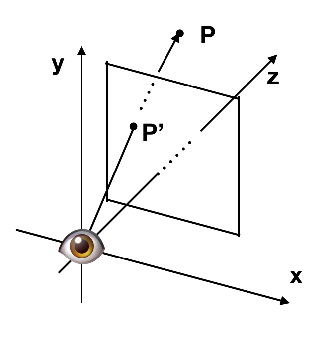
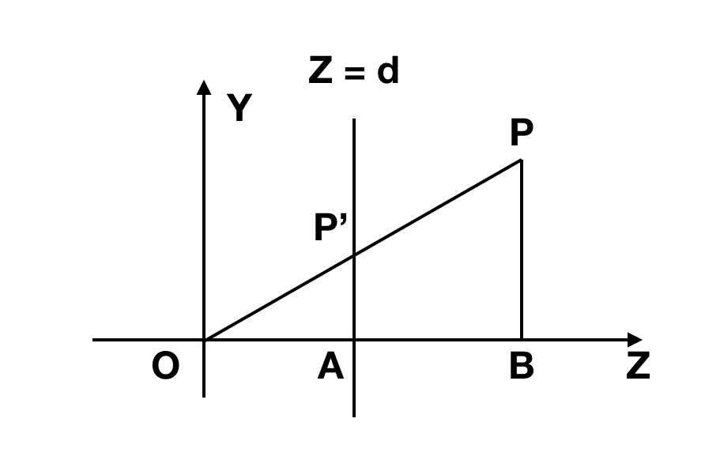
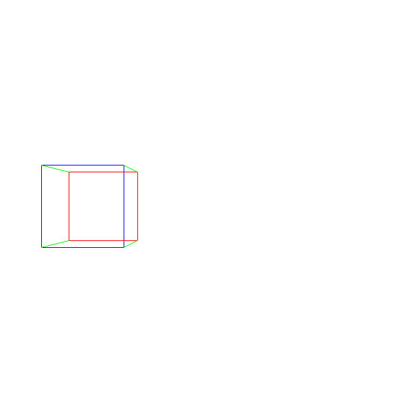

# 投影

依旧如同之前一样来放👁和坐标系：




考察空间中的一个点P，看它投影在窗户上的店P‘：



由图可以看出来：

$$
\frac{|P'A|}{|OA|} = \frac{|PB|}{|OB|}   
$$
$$
|P'A| = \frac{|PB| \cdot |OA| }{|OB|}   
$$

所以可知：

$$
P{_Y}' = \frac{P_Y \cdot d}{P_Z}   
$$


同理可知：

$$
P{_X}' = \frac{P_X \cdot d}{P_Z}   
$$


$$
P{_z}' = d   
$$

##  窗户到画布


然后窗户到canvas的变换是之前的 CanvasToViewport(x, y)的逆变换吧：

```
ViewportToCanvas{
	return (x * Cw/Vw, y * Ch/Vh)
}

ProjectVertex(v){
	return ViewportToCanvas(v.x * d / v.z, v.y * d / v.z)
}
```


## 画正方体

```
# The four 'front' vertexes
vAf = [-1, 1, 1]
vBf = [1, 1, 1]
vCf = [1, -1, 1]
vDf = [-1, -1, 1]

# The four 'back' vertexes
vAb = [-1, 1, 2]
vBb = [1, 1, 2]
vCb = [1, -1, 2]
vDb = [-1, -1, 2]

# The front face.
DrawLine(ProjectVertex(vAf), ProjectVertex(vBf), BLUE);
DrawLine(ProjectVertex(vBf), ProjectVertex(vCf), BLUE);
DrawLine(ProjectVertex(vCf), ProjectVertex(vDf), BLUE);
DrawLine(ProjectVertex(vDf), ProjectVertex(vAf), BLUE);


# The back face.
DrawLine(ProjectVertex(vAb), ProjectVertex(vBb), RED);
DrawLine(ProjectVertex(vBb), ProjectVertex(vCb), RED);
DrawLine(ProjectVertex(vCb), ProjectVertex(vDb), RED);
DrawLine(ProjectVertex(vDb), ProjectVertex(vAb), RED);

# The front-to-back edges.
DrawLine(ProjectVertex(vAf), ProjectVertex(vAb), GREEN);
DrawLine(ProjectVertex(vBf), ProjectVertex(vBb), GREEN);
DrawLine(ProjectVertex(vCf), ProjectVertex(vCb), GREEN);
DrawLine(ProjectVertex(vDf), ProjectVertex(vDb), GREEN);
```


## 画图

这里我偷个懒，就用PIL的画线来处理了，缩短代码量 o(╯□╰)o





[链接](code/raster04.py)


