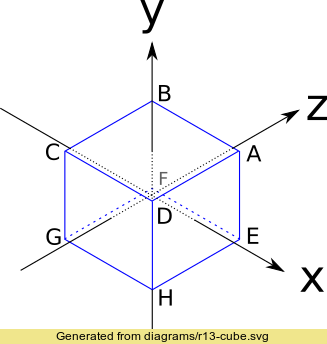
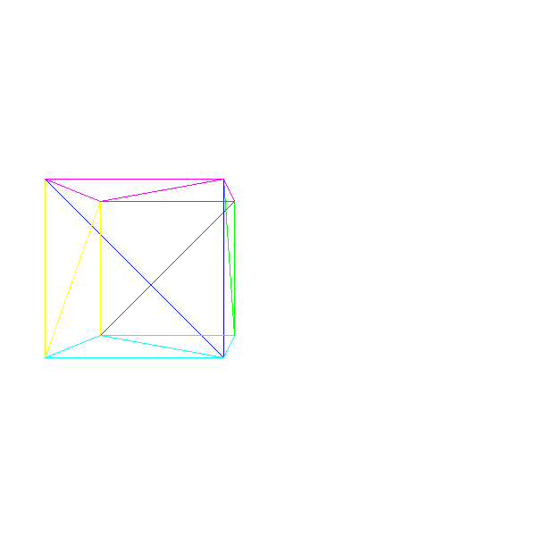

# 画正方体


我们在空间中放入这样一个正方体




对应的顶点坐标是：

- A = (1, 1, 1)
- B = (-1, 1, 1)
- C = (-1, -1, 1)
- D = (1, -1, 1)
- E = (1, 1, -1)
- F = (-1, 1, -1)
- G = (-1, -1, -1)
- H = (1, -1, -1)
 
鉴于我们已经知道如何处理三角形，有 drawWiredTriangleFrame 函数在前。我们这里把这个正方体看成是三角形的的状况来处理，我们可以把这个正方体看成以下一堆三角形

```
ABC ACD
EAD EHD
FEH FGH
BFG BCG
EFB EAB
CGH CDH
```

这样我们就可以用两个列表来表示坐标和三角形：

```
顶点
0 = ( 1,  1,  1)
1 = (-1,  1,  1)
2 = (-1, -1,  1)
3 = ( 1, -1,  1)
4 = ( 1,  1, -1)
5 = (-1,  1, -1)
6 = (-1, -1, -1)
7 = ( 1, -1, -1)

三角形
 0 = 0, 1, 2, red
 1 = 0, 2, 3, red
 2 = 4, 0, 3, green
 3 = 4, 3, 7, green
 4 = 5, 4, 7, blue
 5 = 5, 7, 6, blue
 6 = 1, 5, 6, yellow
 7 = 1, 6, 2, yellow
 8 = 4, 5, 1, purple
 9 = 4, 1, 0, purple
10 = 2, 6, 7, cyan
11 = 2, 7, 3, cyan
```

8各顶点，6个面，12个三角形。✔️


这样来画物体就很简单， 首先投影每个顶点，然后根据顶点的投影来画三角形

```
RenderObject(vertexes, triangles){
	projected = []
	for V in vertexes{
		projected.append(ProjectVertex(V))
	}
	for T in triangles{
		RenderTriangle(T, projected)
	}
}

RenderTriangle(triangle, projected){
	DrawWireFrameTriangle(projected[triangle.v[0]],
	projected[triangle.v[1]],
	projected[triangle.v[2]],
	triangle.color)
}
```

不过这里的坐标有些会在镜头后面，这里我们来移动整个物体

$$
 \overrightarrow{T} = \begin{pmatrix}
  -1.5  \\
  0 \\
  7 \\ 
 \end{pmatrix}
$$


那么

$$
V' = V + \overrightarrow{T} 
$$


## 画图

这里我偷个懒，就用PIL的画线来处理了，这样可以缩短代码量 o(╯□╰)o





[链接](code/raster05.py)


