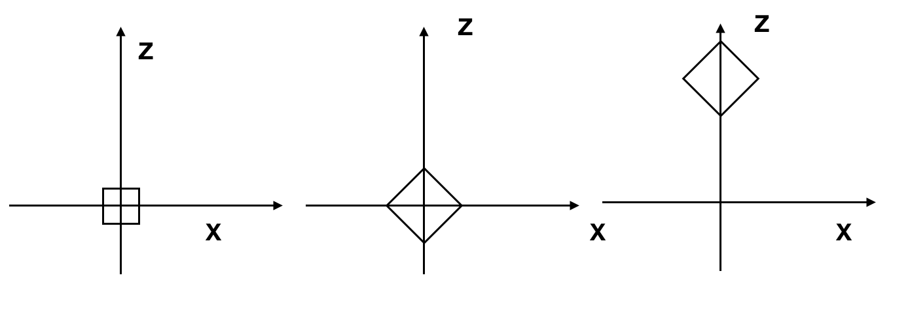
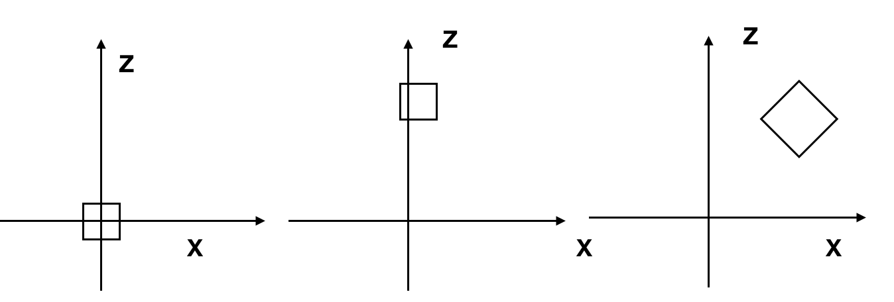

# 位置变换

## 移动物体

之前我们在RenderInstance中变换了物体的位置：

```
RenderInstance(instance){
	projected = []
	model = instance.model
	for V in model.vertexes{
		V' = V + instance.position
		projected.append(ProjectVertex(V'))
	}
	for T in model.triangles{
		RenderTriangle(T, projected)
	}
}
```


其实对于物体位置，并非只有位置的改变，我们可以 scale, rotation 和 translation. 但是需要注意他们的顺序：




先缩放，再旋转，再移动。



先移动，再旋转，再缩放。


所以一般来说是最后做移动 translation。对于这个变换的描述如下：


```
instance {
	model = cube
	transform {
		scale = 1.5
		rotation = < 45° around the Y axis>
		translation = (1, 2, 3)
	}
}
```

而这个也可以写成函数的形式，所以 RenderInstance() 可以重写成：


```
RenderInstance(instance){
	projected = []
	model = instance.model
	for V in model.vertexes{
		V' = ApplyTransform(V, instance.transform)
		projected.append(ProjectVertex(V'))
	}
	for T in model.triangles{
		RenderTriangle(T, projected)
	}
}


ApplyTransform(vertex, transform){
	V1 = vertex * transform.scale
	V2 = V1 * transform.rotation
	V3 = V2 + transform.translation
	return V3
}
```

## 移动摄像头/👁


实际上移动👁和移动物体是不可分辨的，比如我们把👁朝前移，也就是把物体靠近，旋转眼睛的位置也是相当于固定👁，旋转物体。


```
V1 = V - camera.translation
V2 = V1 * inverse(camera.rotation)
V3 = perspective_projection(V2)
```


## 叠加起来


移动物体

```
V1 = V * transform.scale
V2 = V1 * transform.rotation
V3 = V2 + transform.translation
```

移动👁


```
V4 = V3 - camera.translation
V5 = V4 * inverse(camera.rotation)
```

投影

```
vx = v5.x * d / v5.z
vy = v5.y * d / v5.z
```

看的窗户到canvas

```
cx = vx * cw / vw
cy = vy * ch / vh
```

当然其实还有一步， canvas画布到屏幕。

用$C_T, C_R$表示camera的translation 和 rotation，$I_R, I_S, I_T$ 表示物体的 rotation， scale 和 translation， P表示 投影，M表示 窗户到画布。 $V$表示原始坐标。 $V'$表示画布上的点那么

$$
V' = M(P(C_R^{-1}(C_T^{-1}(I_T(I_S(I_R(V)))))))
$$

同时注意我们依旧把变化放在最终位置。

写F如下：

$$
F = M \cdot P \cdot C_R^{-1} \cdot C_T^{-1} \cdot I_T \cdot I_S \cdot I_R
$$

$$
V' = F(V)
$$


