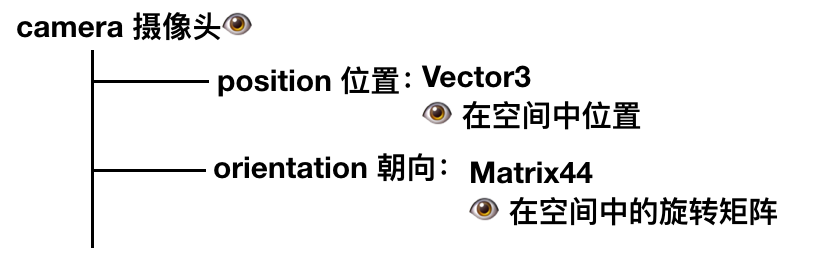
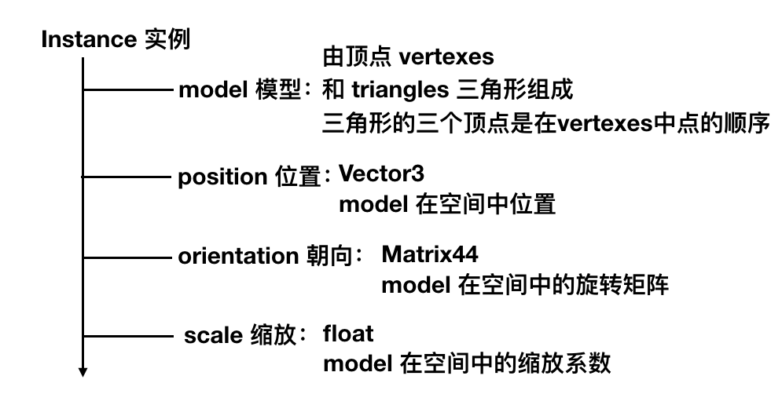

# 数学知识

是时候复习一波数学知识了。


## 齐次坐标

点：

$$
\begin{pmatrix}
  x  \\
  y \\
  z \\
  1 \\ 
 \end{pmatrix}
$$

向量：

$$
\begin{pmatrix}
  x  \\
  y \\
  z \\
  0 \\ 
 \end{pmatrix}
$$


这样是有意义的，比如点 $P - O$ 是向量，$O + \overrightarrow{D}$ 是位置点P， 所以取 w = 1 代表位置更为舒适。而且也赋予了运算更多意义。


$$
\begin{pmatrix}
  x  \\
  y \\
  z \\
  w \\ 
 \end{pmatrix}
$$


如果是 v4 需要变成 v3 

$$
\begin{pmatrix}
  x  \\
  y \\
  z \\
  w \\ 
 \end{pmatrix} 
 = 
\begin{pmatrix}
  x/w  \\
  y/w \\
  z/w \\
  1 \\ 
 \end{pmatrix}
 =
 \begin{pmatrix}
  x/w  \\
  y/w \\
  z/w \\
 \end{pmatrix}
$$

## 齐次旋转矩阵


$$
\begin{pmatrix}
 A & B & C \\
 D & E & F \\
 G & H & I\\
\end{pmatrix}
\cdot
\begin{pmatrix}
 x  \\
 y \\
 z \\
\end{pmatrix}
 =
\begin{pmatrix}
 x'  \\
 y' \\
 z' \\
\end{pmatrix}
$$

写成齐次方程


$$
\begin{pmatrix}
 A & B & C & 0 \\
 D & E & F & 0\\
 G & H & I & 0\\
 0 & 0 & 0 & 1
\end{pmatrix}
\cdot
\begin{pmatrix}
 x  \\
 y \\
 z \\
 1
\end{pmatrix}
 =
\begin{pmatrix}
 x'  \\
 y' \\
 z' \\
 1
\end{pmatrix}
$$


## 齐次scale矩阵


$$
\begin{pmatrix}
 S_x & 0 & 0 \\
 0 & S_y & 0 \\
 0 & 0 & S_z\\
\end{pmatrix}
\cdot
\begin{pmatrix}
 x  \\
 y \\
 z \\
\end{pmatrix}
 =
\begin{pmatrix}
 x \cdot S_x  \\
 y \cdot S_y \\
 z \cdot S_z \\
\end{pmatrix}
$$


写成齐次方程:


$$
\begin{pmatrix}
 S_x & 0 & 0 & 0 \\
 0 & S_y & 0 & 0\\
 0 & 0 & S_z & 0\\
 0 & 0 & 0 & 1
\end{pmatrix}
\cdot
\begin{pmatrix}
 x  \\
 y \\
 z \\
 1 \\
\end{pmatrix}
 =
\begin{pmatrix}
 x \cdot S_x  \\
 y \cdot S_y \\
 z \cdot S_z \\
 1
\end{pmatrix}
$$


## 齐次translation方程

其实如果用不变成齐次方程的话， 移动位置不是线性变换，就更无法用一个矩阵来表示了，感谢聪明的齐次写法：


$$
\begin{pmatrix}
 T_x \\
 T_y \\
 T_z \\
 0
\end{pmatrix}
+
\begin{pmatrix}
 x  \\
 y \\
 z \\
 1 \\
\end{pmatrix}
 =
 \begin{pmatrix}
 A & B & C & D \\
 E & F & G & H\\
 I & J & K & L\\
 M & N & O & P
\end{pmatrix}
\cdot
\begin{pmatrix}
 x  \\
 y \\
 z \\
 1
 \end{pmatrix}
 =
\begin{pmatrix}
 x + T_x  \\
 y + T_y \\
 z + T_z \\
 1
\end{pmatrix}
$$

通过一点点推理可以知道：

$$
\begin{pmatrix}
 T_x \\
 T_y \\
 T_z \\
 0
\end{pmatrix}
+
\begin{pmatrix}
 x  \\
 y \\
 z \\
 1 \\
\end{pmatrix}
 =
 \begin{pmatrix}
 1 & 0 & 0 & T_x \\
 0 & 1 & 0 & T_y\\
 0 & 0 & 1 & T_z\\
 0 & 0 & 0 & 1
\end{pmatrix}
\cdot
\begin{pmatrix}
 x  \\
 y \\
 z \\
 1
 \end{pmatrix}
 =
\begin{pmatrix}
 x + T_x  \\
 y + T_y \\
 z + T_z \\
 1
\end{pmatrix}
$$

## 投影矩阵


$$
\begin{pmatrix}
 A & B & C & D \\
 E & F & G & H\\
 I & J & K & L
\end{pmatrix}
\cdot
\begin{pmatrix}
 x  \\
 y \\
 z \\
 1
 \end{pmatrix}
 =
\begin{pmatrix}
 x \cdot d \\
 y \cdot d \\
 z 
\end{pmatrix}
$$


$$
\begin{pmatrix}
 \cfrac{x \cdot d}{z} \\
 \cfrac{y \cdot d}{z} \\
\end{pmatrix}
$$


推理可得

$$
\begin{pmatrix}
 d & 0 & 0 & 0 \\
 0 & d & 0 & 0\\
 0 & 0 & 1 & 0
\end{pmatrix}
\cdot
\begin{pmatrix}
 x  \\
 y \\
 z \\
 1
 \end{pmatrix}
 =
\begin{pmatrix}
 x \cdot d \\
 y \cdot d \\
 z 
\end{pmatrix}
$$


## 窗户到画布


$$
\begin{pmatrix}
 \frac{c_w}{v_w} & 0 & 0 & 0 \\
 0 & \frac{c_h}{v_h} & 0 & 0\\
 0 & 0 & 1 & 0
\end{pmatrix}
\cdot
\begin{pmatrix}
 x \\
 y \\
 z \\
 1
 \end{pmatrix}
 =
\begin{pmatrix}
  \frac{c_w \cdot x}{v_w}\\
  \frac{c_h \cdot y}{v_h}\\
 z 
\end{pmatrix}
$$

这样甚至我们还可以吧之前的投影矩阵结合起来，一步达到 3d - 画布的效果：


$$
\begin{pmatrix}
 \frac{d \cdot c_w}{v_w} & 0 & 0 & 0 \\
 0 & \frac{c_h}{v_h} & 0 & 0\\
 0 & 0 & 1 & 0
\end{pmatrix}
\cdot
\begin{pmatrix}
 x \\
 y \\
 z \\
 1
 \end{pmatrix}
 =
\begin{pmatrix}
  \frac{c_w \cdot x}{v_w}\\
  \frac{c_h \cdot y}{v_h}\\
 z 
\end{pmatrix}
$$


不过一般来说我们并不采用矩阵，而是直接这样：

$$
x' = \cfrac{x \cdot d \cdot c_w}{z \cdot v_w}
$$

$$
y' = \cfrac{y \cdot d \cdot c_h}{z \cdot v_h}
$$


再根据之前的

$$
F = M \cdot P \cdot C_R^{-1} \cdot C_T^{-1} \cdot I_T \cdot I_S \cdot I_R
$$

$$
V' = F \cdot V
$$


分离一下：

$$
M_{Camera} = C_R^{-1} \cdot C_T^{-1}
$$

$$
M_{Model} = I_T \cdot I_S \cdot I_R
$$


$$
M =  M_{Camera} \cdot M_{Model} 
$$


## 再画两个正方体

然后我们根据以上的数学知识，再来画两个正方体，这次我们来抽象更多的东西，首先我们有场景(scene), 在场景中有摄像头/眼睛(camera), 然后还有之前提到的实例(instance)。

对于camera，它有自己的位置和朝向。



对于instance，它也有自己的位置，朝向和缩放。




那么代码的部分可以这样写：


```
RenderModel(model, transform) {
    projected = []
    for V in model.vertexes {
        projected.append(ProjectVertex(transform * V))
    }
    for T in model.triangles {
        RenderTriangle(T, projected)
    }
}

RenderScene() {
    MCamera = MakeCameraMatrix(camera.position, camera.orientation)

    for I in scene.instances {
        M = MCamera*I.transform
        RenderModel(I.model, M)
    }
}
```


## 画图


放两个正方体，变换一下，然后画一下图:


[链接](code/raster07.py)

