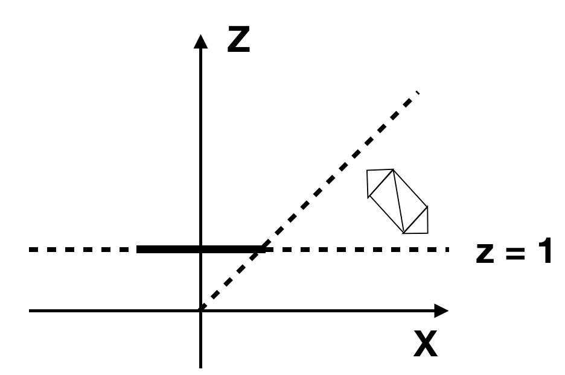
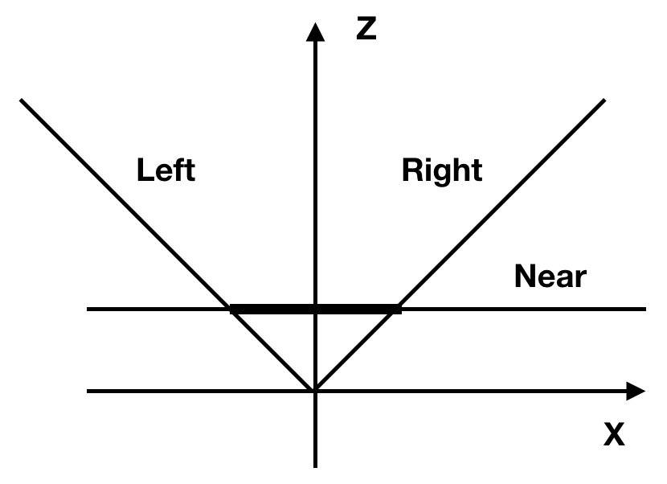

# Clipping plane

回来看这个投影公式：

$$
P_x' = \cfrac{P_x \cdot d}{ P_Z}
$$

$$
P_y' = \cfrac{P_y \cdot d}{ P_Z}
$$

但是可能出现的问题是：

- 除以0
- 对于很小的Pz，可能失真

所以我们应该学习比如像 z = d 一样用一个平面来 clip.

## 平面

我们知道三维世界中的一个平面可以这样来：

$$
Ax + By + Cz + D = 0
$$

实际可以写成

$$
\overrightarrow{N} \cdot P + D = 0
$$

$ \overrightarrow{N} = (A, B, C)$

可以继续写：

$$
k \cdot \overrightarrow{N} \cdot P + k \cdot D = 0
$$

继续：

$$
\overrightarrow{N'} \cdot P + D' = 0
$$

还是写回

$$
\overrightarrow{N} \cdot P + D = 0
$$

$\overrightarrow{N} $ 为单位向量， $-D$是原点到平面的'signed distance'. 实际上$\overrightarrow{N} \cdot P + D$ 就是 P 到平面的 'signed distance'，为0 就是P在平面上的特殊状况。

对于 $ Z = d$ 我们就是可以选择 $\overrightarrow{N} = (0, 0, 1)$， 当然对应 $D = -d$.

或者也可以选取相反的 $\overrightarrow{N}$ 和 $D$.

## Clipping volume

根据我们的数据

如果我们的 foc 都选 90°的，那么如下：

- left plane 的 $\overrightarrow{N}$ 是 $ (\cfrac{1}{\sqrt2}, 0, \cfrac{1}{\sqrt2})$
- right plane 的 $\overrightarrow{N}$ 是 $ (-\cfrac{1}{\sqrt2}, 0, \cfrac{1}{\sqrt2})$
- bottom plane 的 $\overrightarrow{N}$ 是 $ ( 0, \cfrac{1}{\sqrt2}, \cfrac{1}{\sqrt2})$
- top plane 的 $\overrightarrow{N}$ 是 $ ( 0, -\cfrac{1}{\sqrt2}, \cfrac{1}{\sqrt2})$

所有的 $ D = 0$ 因为都通过原点。

