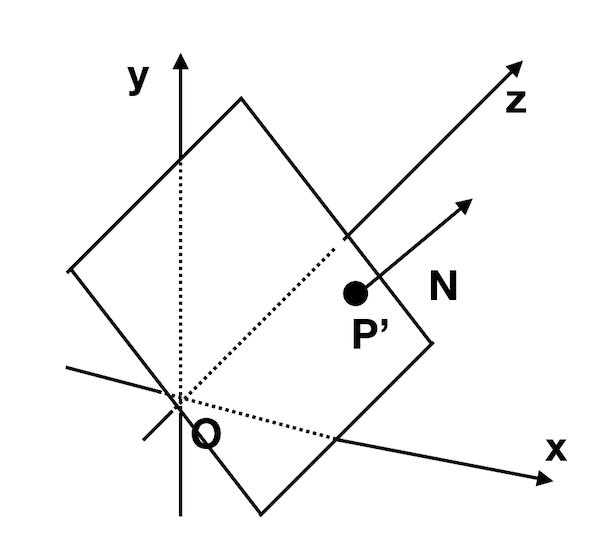
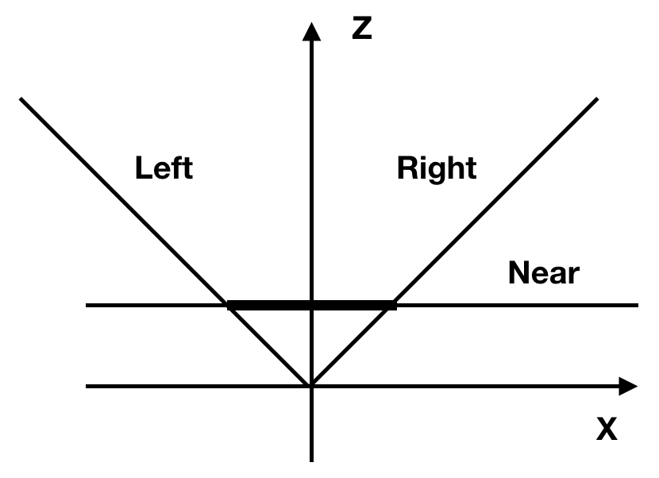
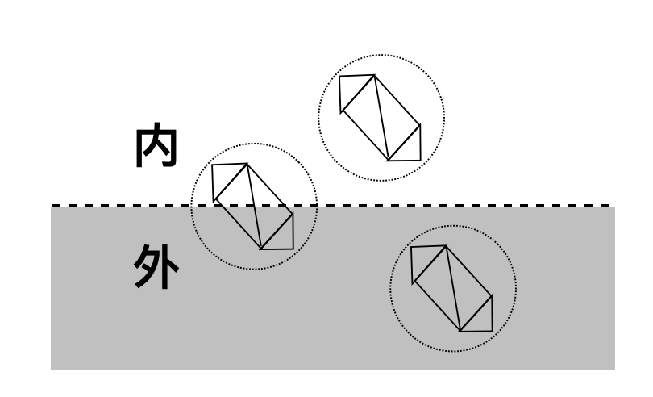
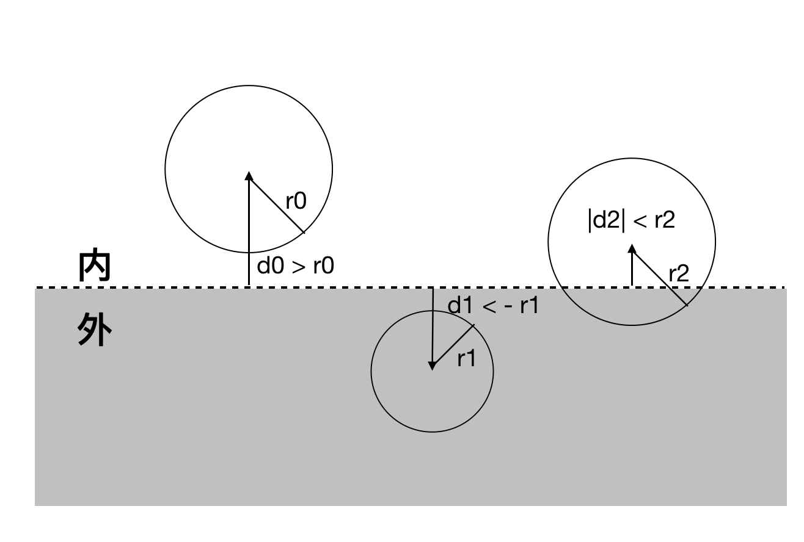
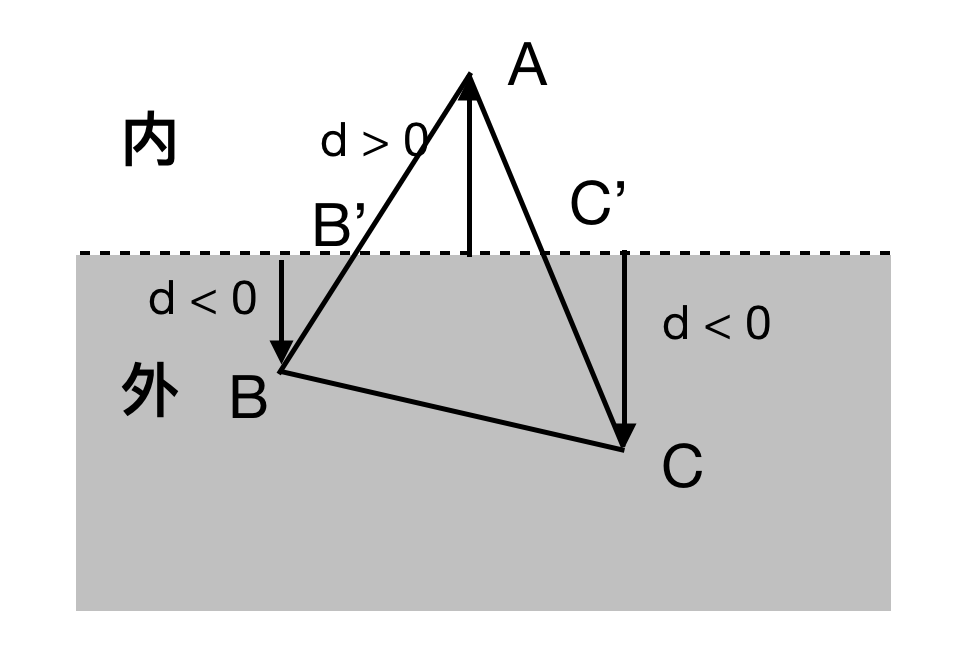
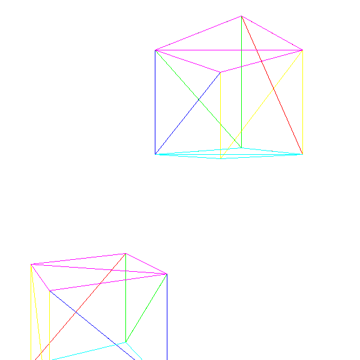

# 裁剪

回来看这个投影公式：

$$
P_x' = \cfrac{P_x \cdot d}{ P_Z}
$$

$$
P_y' = \cfrac{P_y \cdot d}{ P_Z}
$$

但是可能出现的问题是：

- 除以0
- 对于很小的Pz，可能失真

所以我们应该学习比如像 z = d 一样用一个平面来裁剪物体.

## 平面

我们知道三维世界中的一个平面可以这样来：

$$
Ax + By + Cz + D = 0
$$

实际可以写成

$$
\overrightarrow{N} \cdot P + D = 0
$$

$$ \overrightarrow{N} = \begin{bmatrix} A \\ B \\C \end{bmatrix} $$

可以继续写：

$$
k \cdot \overrightarrow{N} \cdot P + k \cdot D = 0
$$

继续：

$$
\overrightarrow{N'} \cdot P + D' = 0
$$

取$\overrightarrow{N'} = \overrightarrow{N}$为单位向量，继续写回：

$$
\overrightarrow{N} \cdot P + D = 0
$$

关于这个公式，可以有很多理解，比如其实我们也可以这样理解平面:

法向量为$\overrightarrow{N}$，平面上有点$P'$.

所以会有平面上的所有点$P$满足的: 

$$
\overrightarrow{N} \cdot (P - P') = 0
$$

而如果我们要计算任意一点 $Q$ 到平面的位置可以这样来， 计算 $|Q - Q'|$, $Q'$ 为Q在平面上的投影，我们可知：

$$
Q - Q' = t \cdot \overrightarrow{N}
 $$

两边同时乘以 $\overrightarrow{N}$:

$$
\overrightarrow{N}(Q - Q') = t \cdot \overrightarrow{N} \cdot \overrightarrow{N} = t 
$$

$Q'$ 在平面上， 代入平面公式

$$
\overrightarrow{N} \cdot Q' + D = 0
$$

所以

$$
\overrightarrow{N} \cdot Q + D = t 
$$

实际上$\overrightarrow{N} \cdot Q + D$ 就是 Q 到平面的 'signed distance'，为0 就是P在平面上的特殊状况。

对于 $ Z = d$ 我们就是可以选择 $\overrightarrow{N} = (0, 0, 1)$， 对应 $D = -d$.

## Clipping volume

根据我们的数据

如果我们的 foc 都选 90°的，那么如下：

- left plane 的 $\overrightarrow{N}$ 是 $ (\cfrac{1}{\sqrt2}, 0, \cfrac{1}{\sqrt2})$
- right plane 的 $\overrightarrow{N}$ 是 $ (-\cfrac{1}{\sqrt2}, 0, \cfrac{1}{\sqrt2})$
- bottom plane 的 $\overrightarrow{N}$ 是 $ ( 0, \cfrac{1}{\sqrt2}, \cfrac{1}{\sqrt2})$
- top plane 的 $\overrightarrow{N}$ 是 $ ( 0, -\cfrac{1}{\sqrt2}, \cfrac{1}{\sqrt2})$

所有的 $ D = 0$ 因为都通过原点。

## 裁剪整个物体

我们先来尝试裁剪整个物体，如果我们刚好有一个球可以包住物体，那么我们可以计算球到平面的位置，如果整个球刚好在平面之内，那么我们就绘制整个物体，如果球在整个平面之外，那么我们就不需要绘制物体。但是对于和平面相交的球，我们就需要进一步的计算。

计算的时候就可以用我们刚刚提到的 signed distance.

## 裁剪三角形

对于相交的状况，我们需要裁剪三角形，对应的也有以下情况：

- 三顶点全在平面内
- 三顶点全在平面外
- 一顶点在平面内
- 两顶点在平面内

对于一顶点在平面内，我们需要丢掉$ABC$, 画三角形$AB'C'$.

对于两顶点在平面内，我们需要丢掉$ABC$， 画$ABA'$ 和 $A'B'B$.

## 计算线与面的交点 B'

$B'$ 则是 直线 AB 与平面的交点。

平面公式：

$$
\overrightarrow{N} \cdot P + D = 0
$$

直线可以写成： 

$$
P = A + t(B - A), 0 \le t \le 1
$$

代入：

$$
\overrightarrow{N} \cdot (A + t(B - A)) + D = 0
$$

$$
t = \frac{-D - \overrightarrow{N} \cdot A}{ \overrightarrow{N} \cdot (B - A)}
$$

因为我们已经假定直线和平面相交，所以 t 总是有解，当我们计算出来 t 之后，再代回原公式得到交点Q：

$$
Q = A + t(B - A)
$$

甚至我们可以根据 Q 来计算与 Q 相关的一些属性：

$$
\alpha_Q = \alpha_A + t(\alpha_B - \alpha_A)
$$

## 画图

注意我们整个流程可以这样画出来：

注意代码有比较大的改动。

结果

[代码](code/raster08.py)

