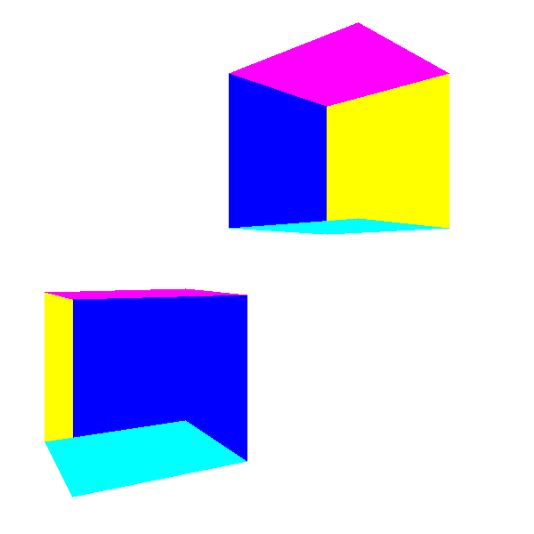

# 隐藏面消除

我们先利用现有的代码来填充画正方体的三角形，而不是框架：



不太好看，那是因为我们把有些背面的东西画到了前面，比如下面的正方体的底部。我们画三角形的时候并没有先后顺序，而是根据他们的定义的顺序来画的。

这里我们就要解决这个问题。

## Painter’s algorthim

最容易想到的办法就是先画后方的东西，然后再画前面的东西，这个实现的话 - 可以首先把三角形transform之后，然后根据他们的z坐标排序，先画后面再画前面。

这个方法的问题在于：

- 最快的排序方式也是$O(nlogn)$
- 我们需要一次就把所有的vertex和triangle放入内存中
- 有些情况根本没有顺序


## Depth buffer

虽然Painter‘s Algorithm对三角形不起作用，但是我们可以用它来处理像素。

对于每个画到画布上的像素，我们只需要画与它最近的颜色。比如$P_1$ 和 $P_2$ 都投影到了 z=d上的P点，我们只需要画近的那个点的颜色。


所以对于像素上的每个点，我们需要记录下它的z值，当我们碰到同样这个点，但是有更小的z值的时候我们就需要更新颜色，否则我们保持原有颜色不变，当然最初我们可以把原始的每个像素的z值都赋值给无穷大。


这个z值当然是物体在transform之后但是透视投影之前的z，但是我们还有一个问题，那就是我们只有每个三角形顶点的z值，我们画填充的时候需要知道三角形中每个点的z值，这里先再看一次上面的图，y是随着z的变化而成比例变化，我们可以把z看成y或者x的性质，别忘了我们画渐变三角形的时候是怎么把h看成三角形中每个点的性质而画出来的。

伪码：

```
z = z_segment[x - xl]
if (z < depth_buffer[x][y]){
	canvas.PutPixel(x, y, color)
	depth_buffer[x][y] = z
}
```

看结果，效果还不错，至于边缘的状况，是因为我们为了 loop interpolation,把 x, y 都变成了 int，其间难免会有一些损失的状况。


## 1/z

我们把 z 看成 x 的性质然后线性插入求出它。这里有一点点问题，比如：


这里可以很容易算出来 M (0, 0, 6).

但实际上：


计算如下：

$$
\frac{M_z - A_z}{M_x' - A_x'} = \frac{B_z - A_z}{B_x' - A_x'}
$$


代入数值：

$$
M_z = 2 + (0 - (-0.5))\frac{10 - 2}{0.1 - (-0.5)} = 8.666
$$

$M_z \neq 6$

问题出在我们假设 z 是 是它们的线性组合，即 $Z = f(x', y')$，那么 $Z = Ax' + By'+ C$.对应这样的状况：

$$
f(x' + \Delta x, y' + \Delta y) - f(x', y') = A(x' + \Delta x) + B(y' + \Delta y) + C - Ax' - By' - C = A \Delta x + B \Delta y
$$

问题在于这里我们的三角形满足公式：

$$
AX + BY + CZ + D = 0
$$

根据 投影公式：

$$
x' = \frac{Xd}{Z}
$$

$$
y' = \frac{Yd}{Z}
$$

所以

$$
X = \frac{Zx'}{d}
$$
$$
Y = \frac{Zy'}{d}
$$


代回原式：

$$
\frac{Ax'Z + By'Z}{d} + CZ + D = 0
$$


$$
Ax'Z + By'Z + dCZ + dD = 0
$$

$$
(Ax' + By' + dC)Z + dD = 0
$$

$$
Z = \frac{-dD}{Ax' + By' + C}
$$


所以Z并不是 x' 和 y‘ 的象形组合，但是 1/Z 则是：

$$
1/Z = \frac{Ax' + By' + C}{-dD}
$$

所以我们可以用 1/Z 而非 Z 来计算，这个时候，我们就需要把所有的depth_buffer 初始化为0，并且比较需要反向。


效果：


这个对我的并没有太大提升，原因之前已经讲过了。o(╯□╰)o.

##  消除背面

实际上这里我们还是做了很多‘无用功’，比如把后方被遮盖的三角形画了一遍。我们还可以效率更高：根据👁可以看到或者看不到来丢弃三角形。


对于看不到的三角形，我们画的时候可以直接丢弃。

这个角度也很容易求出来, 指向外的箭头是三角形的法向量 $\overrightarrow{N}$, $\overrightarrow{V}$ 是由三角形上的点P到眼睛的向量。

那么

$$
cos \alpha = \frac{\overrightarrow{N} \cdot \overrightarrow{V}}{|\overrightarrow{N}| \cdot |\overrightarrow{V}|}
$$

因为我们只用关心 $\alpha$ 是大于 90°还是小于90°，我们只需计算 $\overrightarrow{N} \cdot \overrightarrow{V}$.

- $\overrightarrow{N} \cdot \overrightarrow{V} <= 0$ 背面
- $\overrightarrow{N} \cdot \overrightarrow{V} > 0$ 前面


而对于三角形指向外部的法向量的方向 $\overrightarrow{N}$，我们也很好求， 我们用 $\overrightarrow{AB} \times \overrightarrow{AC}$ .叉乘就能计算出来。

至于$\overrightarrow{V}$，我们用三角形内任意一点$P - O$既可，最简单的P的选择可以是 $(A + B + C)/3$.这里也很容易理解， 对于三角形 BC 边上的任意一点 D 可以是

$$D = B + v(C - B), 0 \le v \le 1$$ 

$$P = A + u(D - A), 0 \le u \le 1$$


$$P = A + u( B + v(C - B) - A), 0 \le u \le 1$$


最终把三角形内部和边上的任意一点P都可以写成：

$$
P = p_1A + p_2B + p_3C
$$

$$
p_1 + p_2 + p_3 = 1
$$

$$
0 \le p_1 \le 1, 0 \le p_2 \le 1, 0 \le p_3 \le 1
$$


其实取 1/3 是这个三角形的中心。

所以我们在代码中添加：看不到的三角形我们提前丢弃，然后再来画。

效果：


[代码](code/raster12.py)