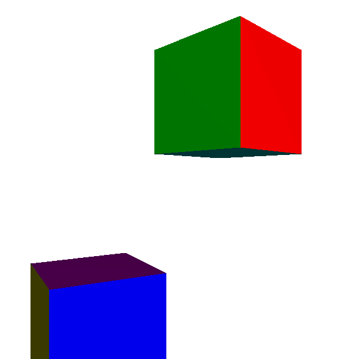
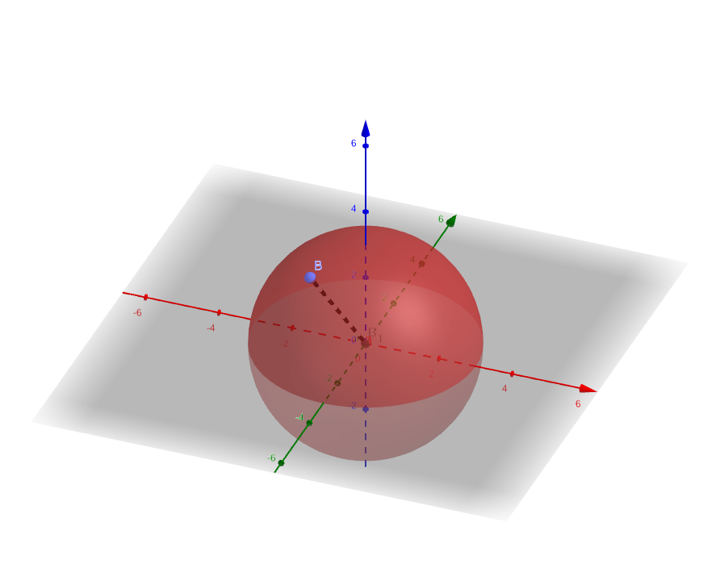
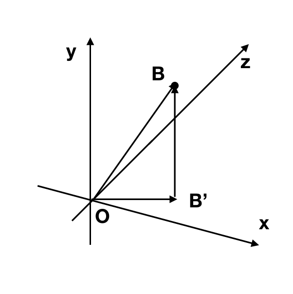
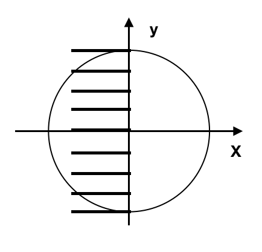
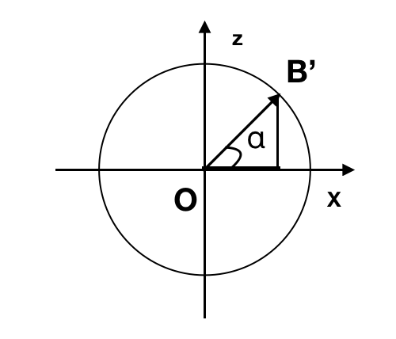
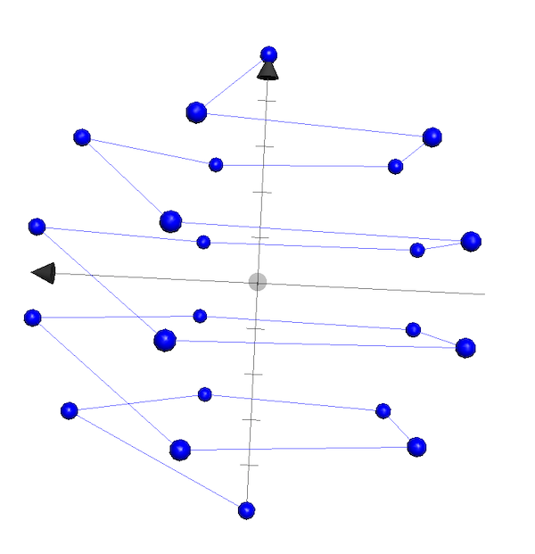
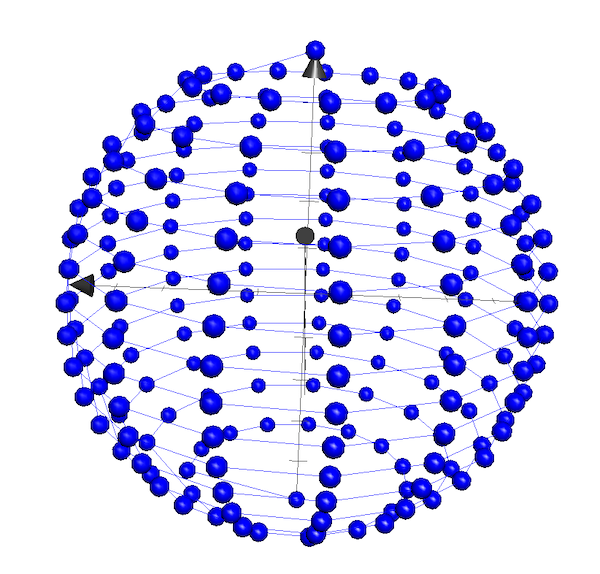
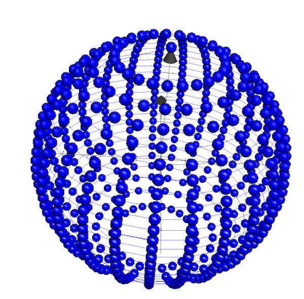
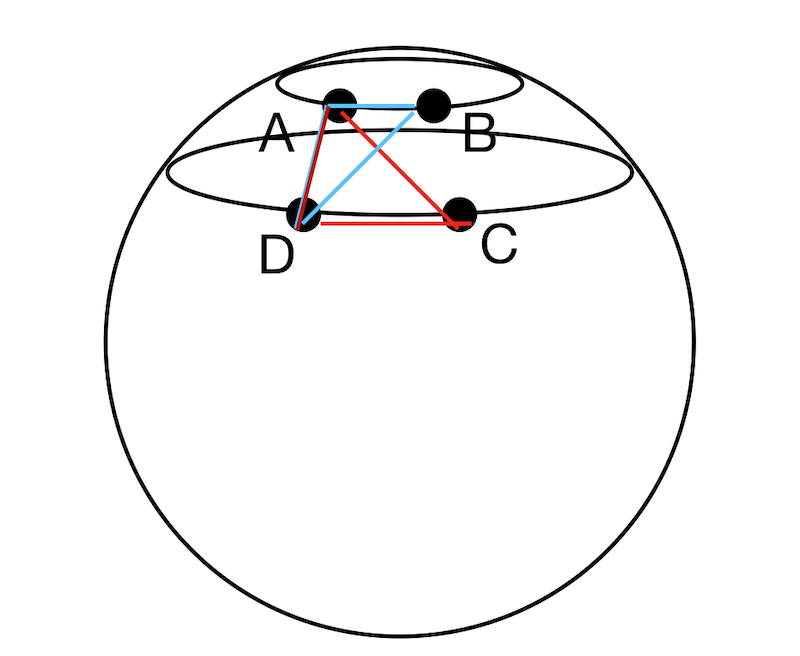
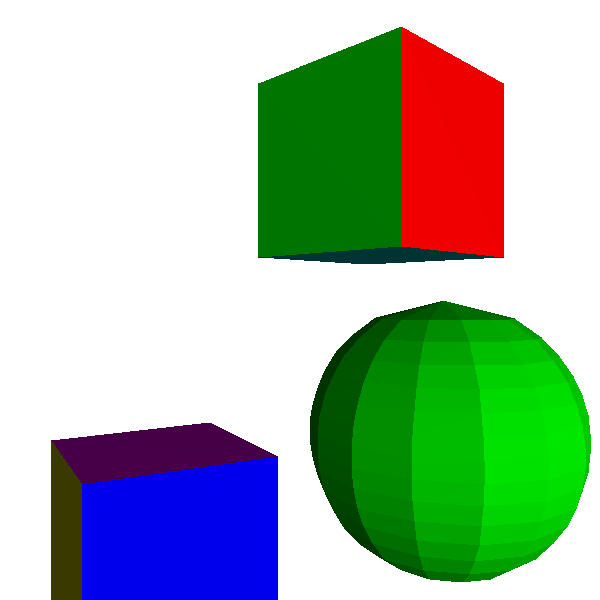

# 着色 Shading 

Shading 并不是照明，照明我们之前已经讲过[模型](https://zhuanlan.zhihu.com/p/63343562)，有点光源，方向光，环境光，并且我们已经知道它是如何与一个点互动。

这里我们要讲的是着色。


## 平面着色 Flat Shading 

我们可以根据公式算出任意一点的光照，因为我们的物体模型都是三角形，我们随意选取三角形中的一点（中心），计算重点的颜色，然后用这一点来着色整个三角形（同样用光照乘以颜色）。

我们来着色两个正方体:




not bad, 但其实我们还是能够看清比如正对着我们这个绿色的面有这个正方形能看出两个三角形的分界线，很正常，按照我们的算法，的确可以看出来。


为了增加一些乐趣性，我现在在场景中添加一个球体，而且这个球体需要满足我们的模型这个类，我们需要用三角形来模仿它。

## 用三角形来模仿球体

### 先从点看起

先从分离的点看起，听起来好像不是很难。




有在O点的半径为 r 的球体，考量球体上任意一点 B。




有

$$
|OB'|^2 + |BB'|^2 = r^2
$$


如果我们把 y 分成 n 份，那么从下往上





$$
y_B = \frac{2 * r * d}{n} - r 
$$


$$
0 \le d \le n
$$

此时我们有了 $|BB'|$， 同样可以得到 $|OB'| = \sqrt{r^2 - y_B^2}$.


有了 $OB'$, 我们此时来研究在 OB'





如果我们同样把 xz 平面的这个 2 * π 来登分成 n 份，那么我们可以知道 

$$
\alpha = \frac{2 \cdot π \cdot i}{n}
$$

$$
0 \le i < n 
$$

因为 2 * π 与 0 重合。


这样给我们就可以得到 B' 点的坐标:

$$
x_B = |OB'| \cdot cos \alpha 
$$

$$
z_B = |OB'| \cdot sin \alpha
$$


结合起来我们就可以得到 B 点的坐标，这就是思路：

- y平分成n段，那么我们就得到了 n+1 个球的截面 - 圆
- 针对每一个y，我们再模拟圆，得到点

有了这个思路，可以写出简单的代码：

```
r = 1
n = 10

from cmath import pi
from math import sqrt, cos, sin


for d in range(n + 1):
    yb = 2 * r * d / n - r
    for i in range(n):
        alpha = 2 * pi * i / n
        rprime = sqrt(r * r - yb * yb)
        xb = rprime * cos(alpha)
        zb = rprime * sin(alpha)
        print (xb,'\t',yb,'\t',zb)
```

发现针对 r = 1, n = 10 已经能够得到很好看的效果。

现在来看几个：

- r = 5, n = 5




基本看不出来球 o(╯□╰)o


- r = 5, n = 15




- r = 5, n = 25



好看多了。

### 分配三角形

有了点之后，我们要把这些点分配成三角形。首先我们肯定不能随机分配，我们需要把靠近点的拿来分配，我们的图中的点就是每一个一个连接起来的，一个最简单的思路就是像这样来分配，靠近的店我们来分配：




所以根据这个思路，可以写出按照点的index来写出的分配像是这样：


```
triangles = []

for i in range(n):
    start = i * n
    for j in range(n - 1):
        a = start + j
        b = a + 1
        c = a + n 
        d = c + 1
        triangles.append(Triangle(a, d, b, color))
        triangles.append(Triangle(a, c, d, color))
```


有了如何模仿球体的伪码之后，我们把它加入代码中，然后再来看结果：



不出我们所料，球体会有一些很明显的面，虽然有一种可爱的效果 n(*≧▽≦*)n 但是想画一个'真一点的球体'的人是不会满意的。

接下来我们就来解决如何解决这些问题，以及除了 flat shading 之外的别的 shading 技术。

