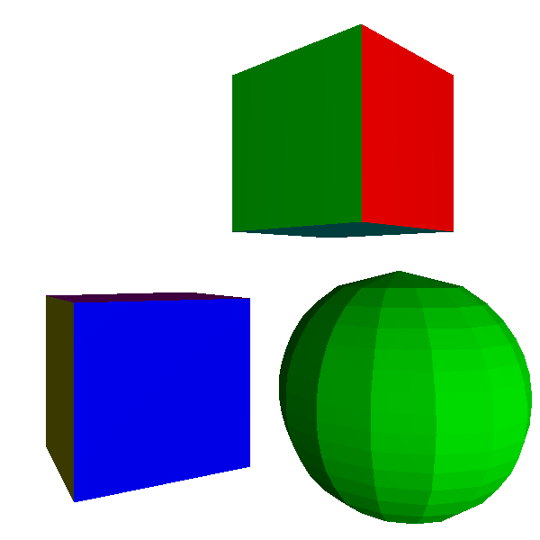
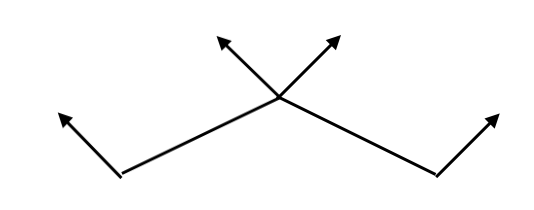
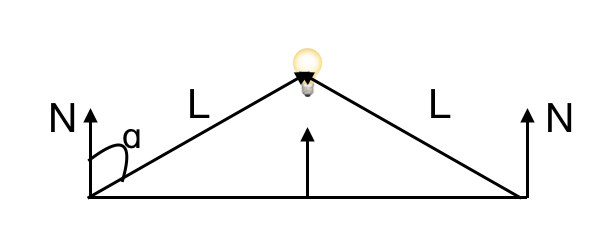

# Gouraud 着色

之前我们看到的球体并不是很‘球’， 一个最简单的优化办法就是像我们画渐变三角形一样，计算出三角形每一个顶点的亮度，然后线性的算出三角形中每一个点的亮度。根据这个来画图。这个办法就叫做 Gouraud 着色，按照这个思路，作用于球和矩形上。




跟上一章的 flat 着色基本没啥区别， o(╯□╰)o

球的状况并没有得到多大改善，这是因为我们依旧是用三角形来模拟球体，而比如相邻的三角形，它们的法向量的计算出来相差很远：



这是属于我们用三角形模拟物体本身的缺陷。一个简单的方法是针对我们每个顶点，我们可以用它‘真实的’法向量，而不是计算出来的。

对于球体，它的法向量就是连接从球心指向球上这一点的向量。这对于我们来说，刚好是小菜一叠，因为我们模拟球的时候就是生成了点，所以我们只要给出对应点的坐标就行了。

按照这样的思路，我们来更新一下 model 原型：

```
model {
    name = cube
    vertexes {
        0 = (-1, -1, -1)
        1 = (-1, -1, 1)
        2 = (-1, 1, 1)
        ...
	}
	triangles {
		0 = {
			vertexes = [0, 1, 2]
			normals = [(-1, 0, 0), (-1, 0, 0), (-1, 0, 0)]
		}
		... 
	}
}
```

所以我们生成球的代码稍作修改：


```
def generateSphere(n, r, color):
    """
    this will generate a sphere sitting in O and divide as mentioned
    """
    vertexes = []
    triangles = []

    for d in range(n+1):
        yb = 2 * r * d / n - r
        for i in range(n):
            alpha = 2 * pi * i / n 
            rprime = sqrt(r * r - yb * yb)
            xb = rprime * cos(alpha)
            zb = rprime * sin(alpha)
            vertexes.append(Vector3(xb, yb, zb))

    for i in range(n):
        start = i * n
        for j in range(n - 1):
            a = start + j
            b = a + 1
            c = a + n 
            d = c + 1
            triangles.append(Triangle(a, d, b, color, vertexes[a], vertexes[d], vertexes[b]))
            triangles.append(Triangle(a, c, d, color, vertexes[a], vertexes[c], vertexes[d]))

    return Model(vertexes, triangles, Vector3(0, 0, 0), r)
```

当然对应的，我们需要更改 cube 的模型，给每个点也填上对应的法向量。

然后计算的时候注意我们做变换的时候法向量也要跟着改变。


这样一看，球体好看一些o(╯□╰)o 

## Gourand着色的缺陷


Gouraud 着色 还有一个问题，就是当我们把点光源挪近的时候，我们当然期待物体会更亮，因为靠近了，但问题是物体反而变暗了。

原因是因为我们计算的是每个顶点上面的亮度，然后根据再根据顶点来做线性插入：




是因为点的法向量和点光源之间的角度 ɑ 会趋近于90°，然后 cos ɑ 会趋近于0，这样导致的结果是我们做线性插入会整个把三角形变暗，而不是按照点的真正的法向量和点光源之间夹角变小，变得更亮。


