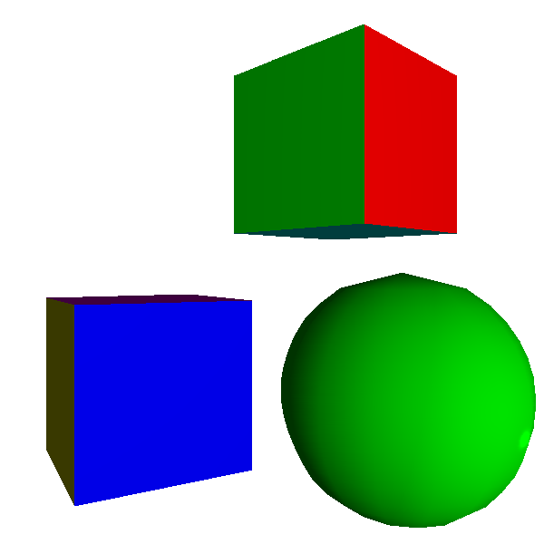

# Phong 着色

- 平面着色： 针对每一个三角形只计算一个光照
- Gouraud 着色： 针对每个三角形计算三个光照，同时针对三角形中每个点做线性插入

在这之上还能想到的优化就是针对每个像素来看它的光照，毕竟我们在光线追踪中就是这么做的。

在这里看看我们的计算，针对画布上的一个点P(x', y')，我们知道:

$$
x' = \frac{Xd}{Z}
$$

$$
y' = \frac{Yd}{Z}
$$

同时我们在做隐藏面消除的时候有 1/z 这个值：

$$
x' = Xd\frac{1}{Z}
$$

$$
y' = Yd\frac{1}{Z}
$$

我们所以我们可以从画布上的投影的点得到空间3d中的点：

$$
X = x' / d_{\frac{1}{Z}}
$$

$$
Y = y' / d_{\frac{1}{Z}}
$$

$$
Z = 1 / d_{\frac{1}{Z}}
$$

除此之外，需要知道:

-  $\overrightarrow{V}$ : 这个很容易计算因为摄像头的位置已知
-  $\overrightarrow{N}$ : 虽然我们只有顶点处的法向量，但是我们有线性插入，o(╯□╰)o，我们可以用线性插入的办法来处理法向量，o(╯□╰)o

按照这个思路，着色结果：

同时发现在 Gouraud 着色中遇到的越靠近点光源越暗的问题也被解决了。因为我们这里的法向量是线性插入得到的。cool.
