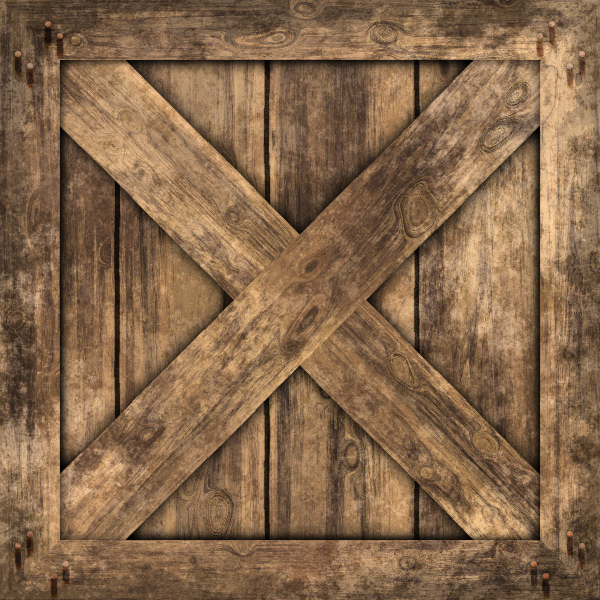
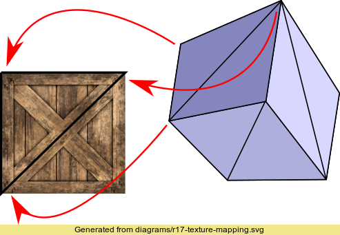
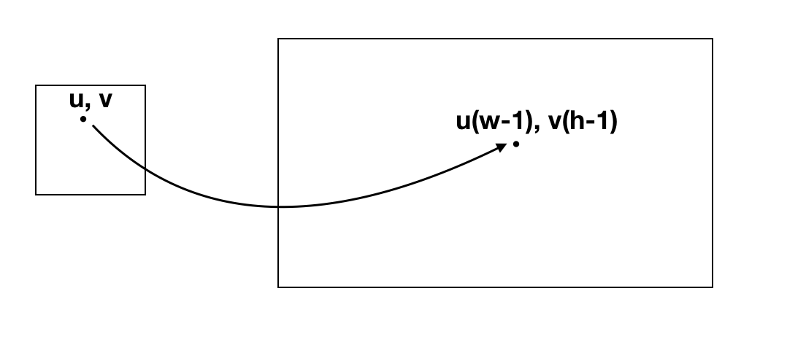
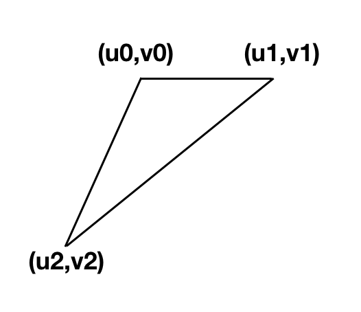
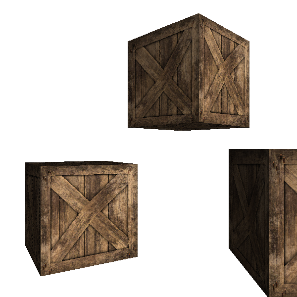
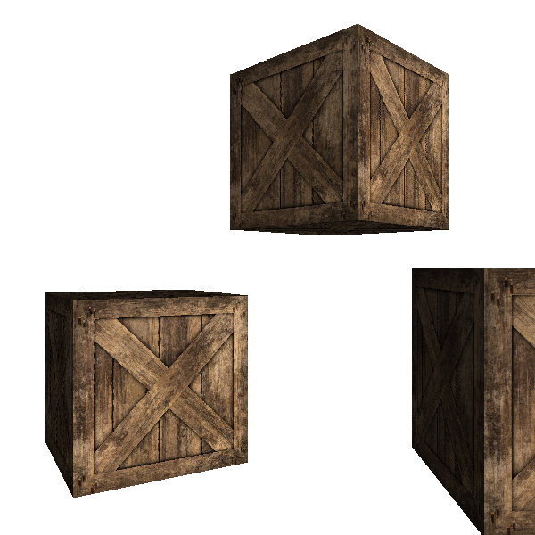

# 纹理

我们不仅仅想画球体和正方体，我们也像让物体‘逼真’起来，比如我们想画一个木头的集装箱。有两个思路：

- 画很多三角形然后来重现木头的纹理
- 给我们已经画好的立方体上贴上木质的效果

我们采取第二种方式因为我们已经有了画好的立方体了，╮(╯_╰)╭何况第一种会增加更多的几何，更复杂意味着更慢。

首先我们需要一张图来覆盖在立方体上 

然后我们需要决定这张图如何放在图片上，一个简单的方法是针对每个三角形来看

注意只用图的一部分也是完全ok的。

我们定义 u 和 v

 $$
 0 \le u \le 1
 $$
 
 
 $$
 0 \le v \le 1
 $$

(u, v)  会对应到图片(宽w, 高h)上的 (u(w - 1), v(h - 1))，这样定义的的好处当然很多啦， 比如我们可以随意换纹理图，还可以随意换纹理图大小...等等等。

针对每个三角形的顶点我们有 (u, v)， 同样用线性插值算出对于三角形的每一点的 (u, v)，然后根据这个 (u, v) 来画图。

看结果：

不错，但是如果我们仔细一点看正方体的中间部分，发现它是弯折的，o(╯□╰)o，问题还是在于我们假设 u 和 v 在屏幕中是线性变化的。这就跟我们 Depth buffer 一样的道理，我们需要用的是

$$
u = \frac{\frac{u}{z}}{\frac{1}{z}}
$$

$$
v = \frac{\frac{v}{z}}{\frac{1}{z}}
$$

修正之后的效果：

